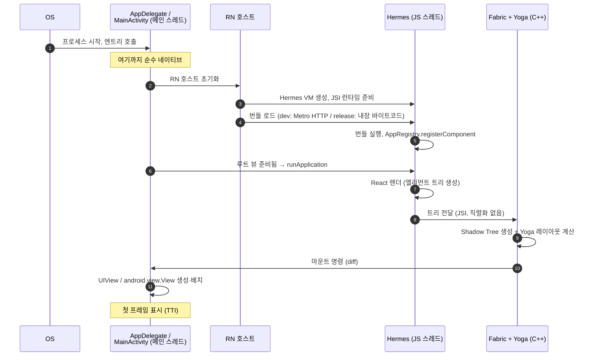

# 앱 실행 시퀀스

> 아이콘 탭부터 첫 화면까지: 네이티브 엔트리 → JS 런타임 준비 → [[Bundle]] 로드 → [[Hermes]] 실행 → React 렌더 → [[Shadow Tree]]·[[Yoga]] 레이아웃 → [[Fabric]] 마운트. 최종 결과물은 **진짜 UIView / android.view.View**다.

## iOS-AOS 대응 개념

| RN 개념 | iOS 대응 | Android 대응 |
|---|---|---|
| 네이티브 엔트리 | `AppDelegate` (`didFinishLaunching...`) | `MainApplication.onCreate` + `MainActivity` |
| RN 호스트 | RN이 관리하는 루트 컨테이너 객체 (구명칭 `RCTBridge`/`RCTRootView` 계열) | `ReactHost` / `ReactActivity`가 감싸는 루트 뷰 |
| JS 번들 | 앱 패키지에 내장된 리소스 (release) | `assets/` 내장 리소스 (release) |
| JS 런타임 | 프로세스 내 임베디드 VM ([[Hermes]]) | 동일 (별도 VM을 프로세스에 내장) |
| 컴포넌트 등록 | `@main` / `UIApplicationMain`이 엔트리를 지정하는 것 | Manifest의 launcher activity 지정 |
| 레이아웃 계산 | Auto Layout 엔진의 역할 | `measure`/`layout` 패스의 역할 |
| 마운트 | `addSubview` + frame 설정 | `addView` + layout 적용 |
| 첫 프레임 | `viewDidAppear` + 첫 CA 트랜잭션 커밋 | 첫 `Choreographer` 프레임 콜백 |

핵심 멘탈모델: **RN 앱도 시작은 100% 네이티브 앱이다.**

- `AppDelegate`/`MainActivity`까지는 여러분이 아는 그 세계 그대로다.
- 거기서 "JS 엔진을 띄우고, JS가 UI 트리를 *지시*하게 하는" 레이어가 얹힌다.
- 지시의 결과는 다시 네이티브 뷰 생성으로 끝난다. JS는 화면을 직접 그리지 않는다.

## 왜 이렇게 설계됐나

- **웹뷰가 아니라 네이티브 뷰**: RN의 설계 목표는 "JS로 로직을 쓰되, 화면은 플랫폼 네이티브 위젯을 그대로 쓴다"이다. Cordova류 하이브리드(웹뷰 렌더링)와의 근본적 차이. 그래서 파이프라인의 마지막 단계가 반드시 `UIView`/`android.view.View` 생성으로 끝난다.
- **JS는 선언, 네이티브는 실행**: JS는 "이런 트리를 그려라"라는 선언만 하고, 레이아웃 계산([[Yoga]], C++)과 실제 뷰 조작([[Fabric]])은 네이티브/C++ 쪽에서 수행한다. UI 스레드를 JS 실행 속도에 종속시키지 않기 위한 분리다.
- **번들이라는 개입 지점**: JS 코드를 하나의 번들 파일로 만들어 로드하는 구조 덕에:
    - dev에서는 [[Metro]] 서버에서 HTTP로 내려받아 [[Fast Refresh]]가 가능하고,
    - release에서는 앱에 내장해 네트워크 없이 즉시 실행이 가능하다.
- **등록(register) → 실행(run)의 2단 구조**: JS가 컴포넌트를 즉시 실행하지 않고 `AppRegistry`에 등록만 해두는 이유는, 네이티브 쪽 준비(루트 뷰 생성, 크기 확정)와 JS 쪽 준비(번들 실행)를 **서로 기다리지 않고 병렬로** 진행시키기 위해서다. 양쪽이 다 준비된 시점에 네이티브가 방아쇠를 당긴다.

## 동작 원리: 7단계 파이프라인

### 1. 네이티브 엔트리 — 여기까지는 순수 네이티브

**iOS**

- 시스템이 프로세스를 띄우고 dyld가 프레임워크를 로드한 뒤 `AppDelegate`의 `application(_:didFinishLaunchingWithOptions:)`가 불린다.
- RN 템플릿의 AppDelegate는 RN이 제공하는 베이스 클래스(버전에 따라 `RCTAppDelegate` 등 — 정확한 클래스명은 공식 문서 확인)를 상속하고, RN 초기화를 그쪽에 위임한다.
- `UIWindow` 생성, `rootViewController` 지정은 평소와 동일하되, 루트 VC의 view 자리에 RN 루트 뷰가 들어간다.

**Android**

- `MainApplication.onCreate()`에서 RN 호스트(`ReactApplication` 계약)를 준비한다.
- 런처 인텐트가 `MainActivity`(RN의 `ReactActivity` 상속)를 띄운다. `setContentView`에 해당하는 일을 `ReactActivity`가 대신하며, 콘텐츠 뷰로 RN 루트 뷰를 붙인다.

이 시점까지 JS는 단 한 줄도 실행되지 않았다. 이 구간의 크래시 스택은 익숙한 네이티브 모양 그대로이고, 여기서의 시작 최적화 기법(불필요한 dylib 정리, `onCreate` 다이어트)도 네이티브 앱과 동일하게 적용된다.

### 2. RN 호스트 초기화 — JS 런타임 준비

RN 호스트가 하는 일:

- [[Hermes]] VM 인스턴스 생성
- [[JSI]] 런타임 연결 — JS와 C++ 세계를 잇는 통로 개설
- JS 전용 스레드 생성 (스레드 구성은 [[02-스레드-모델]] 참고)
- [[Turbo Module]] 시스템 등록 — 단, 각 모듈의 초기화는 lazy라서 실제 첫 호출까지 미뤄진다
- [[Fabric]] 렌더러 준비

[[New Architecture]]([[Bridgeless]]) 기준으로는 과거의 [[Bridge]] 없이 JSI 위에 바로 런타임이 선다. 구 아키텍처에서는 이 단계에서 Bridge 초기화 + 전체 네이티브 모듈 정보 테이블 생성이라는 추가 비용이 있었다 ([[03-구아키텍처-Bridge]]).

### 3. JS 번들 로드

| | dev | release |
|---|---|---|
| 소스 | [[Metro]] 서버에서 HTTP로 다운로드 (`http://localhost:8081/index.bundle...`) | 앱에 내장: iOS `main.jsbundle`, Android `index.android.bundle` |
| 형식 | 변환된 JS 텍스트 | [[Hermes]] 바이트코드 (빌드 타임에 사전 컴파일) |
| 파싱 비용 | JS 파싱 + 컴파일 필요 | **없음** — 이미 바이트코드라 매핑 후 바로 실행 |
| 네트워크 | 필요 (같은 네트워크의 Metro 서버) | 불필요 |
| Fast Refresh | 가능 | 불가 |
| 개발 검증 코드 | 켜짐 (느림) | 꺼짐 |

iOS 개발자 감각으로 옮기면:

- release 번들 = "컴파일된 리소스가 앱 패키지에 들어있는 것" (에셋 카탈로그처럼)
- dev 번들 = "빌드 산출물을 로컬 서버에서 스트리밍 받는 것"
- Hermes 바이트코드 = "소스가 아니라 dex/기계어에 가까운 산출물" — 런타임이 파싱할 게 없다

### 4. JS 실행 + AppRegistry 등록

[[Hermes]]가 번들을 실행한다. 번들 앞부분부터 import된 모듈들의 초기화 코드가 순서대로 돌고, 마지막에 앱의 `index.js`가 실행되며 다음 한 줄이 핵심이다:

```js
import { AppRegistry } from 'react-native';
import App from './App';
import { name as appName } from './app.json';

AppRegistry.registerComponent(appName, () => App);
```

주의해서 볼 점:

- 이건 "네이티브가 `appName`을 요청하면 이 컴포넌트를 루트로 렌더하라"는 **등록**이지 실행이 아니다.
- 네이티브 쪽 루트 뷰가 준비되면 `runApplication`이 트리거되어 실제 렌더가 시작된다.
- iOS의 `@main`/`UIApplicationMain`이 "엔트리 포인트를 시스템에 알려주는" 것과 역할이 비슷하다. Android라면 Manifest에 launcher activity를 선언하는 것에 해당한다.

### 5. React 렌더 — 엘리먼트 트리 생성

React가 루트 컴포넌트부터 함수 컴포넌트들을 호출해 **엘리먼트 트리**를 만든다.

- 엘리먼트 트리 = "어떤 컴포넌트가 어떤 props로 어디에 놓이는지"를 기술한 순수 JS 객체 트리
- 아직 화면 요소는 하나도 없다. 메모리 위의 계산 결과일 뿐이다.
- 전부 JS 스레드에서 일어난다. 첫 화면 컴포넌트가 무겁고 깊을수록 이 단계가 길어진다.

이후 상태 변화 때마다 이 단계가 반복되는 것이 [[Re-render]]이고, 이전 트리와의 비교가 [[Reconciliation]]이다.

### 6. Shadow Tree + Yoga 레이아웃 — C++ 세계

- 엘리먼트 트리가 [[JSI]]를 통해 [[Fabric]] 렌더러(C++)로 전달되어 [[Shadow Tree]]가 만들어진다.
- Shadow Tree는 "화면에 올라갈 노드들의 C++ 사본". 아직 플랫폼 뷰가 아니다.
- 이 트리 위에서 [[Yoga]]가 Flexbox 규칙으로 각 노드의 `x, y, width, height`를 **네이티브 뷰를 만들기 전에** 전부 계산한다.

네이티브 대응:

- Auto Layout 엔진이 제약을 풀어 frame을 산출하는 단계
- Android의 measure/layout 패스
- 차이점: 플랫폼 뷰 인스턴스가 아니라 경량 C++ 노드 위에서 돌기 때문에 뷰 생성 비용 없이, UI 스레드 밖에서 계산할 수 있다.

### 7. Fabric 마운트 — 진짜 네이티브 뷰 생성

- 계산이 끝난 Shadow Tree와 현재 화면 상태의 차이(diff)를 [[Fabric]]이 산출한다.
- **메인(UI) 스레드**에서 마운트를 실행한다: `UIView`/`android.view.View` 인스턴스 생성, addSubview/addView, 계산된 frame 적용.
- Xcode View Hierarchy Debugger나 Android Studio Layout Inspector로 열어보면 실제 네이티브 뷰 계층이 그대로 보인다. **웹뷰는 어디에도 없다.**
- `<View>`는 `UIView`/`ViewGroup` 계열로, `<Text>`는 텍스트 전용 네이티브 뷰로, `<Image>`는 이미지 뷰로 매핑된다.

### 전체 시퀀스 다이어그램



## TTI(Time To Interactive) 관점의 단계별 비용

| 단계 | 비용 성격 | 줄이는 방법 |
|---|---|---|
| 1. 네이티브 엔트리 | 네이티브 앱과 동일 (dylib 로드, `onCreate` 초기화) | 평소의 앱 시작 최적화와 동일 |
| 2. 호스트 초기화 | VM 생성 등 고정 비용, 수십 ms 수준 | RN 버전 업 (지속 개선 중) |
| 3. 번들 로드 | release: 디스크 I/O뿐. dev: 네트워크 + 변환 대기 | dev가 느린 건 정상. 측정은 release로 |
| 4. JS 실행 | **번들 크기에 비례.** 최상단에서 import 되는 모듈 전부 실행됨 | 번들 다이어트, lazy `require`, inline requires 최적화 |
| 5. React 렌더 | 첫 화면 컴포넌트 트리 크기에 비례 | 첫 화면을 얇게, 무거운 탭·모달은 지연 렌더 |
| 6. 레이아웃 | 노드 수에 비례하지만 Yoga는 빠름 (C++) | 보통 병목 아님 |
| 7. 마운트 | 뷰 개수에 비례 (네이티브 뷰 생성 비용) | 뷰 계층 깊이·개수 줄이기 |

경험칙:

- TTI 병목은 대부분 **4번(번들 실행)과 5번(첫 렌더)**이다.
- [[Hermes]]의 사전 컴파일이 4번의 *파싱* 비용을 없애주지만, 모듈 초기화 코드의 *실행* 비용은 남는다. import가 많으면 여전히 느리다.
- 1~2번은 네이티브 앱의 pre-main / cold start 최적화 지식이 그대로 통한다.

## 네이티브 개발자를 위한 자가 점검 Q&A

- **Q. JS가 실행되기 전에 앱이 죽으면?**
  A. 순수 네이티브 크래시다. 평소처럼 dSYM/스택트레이스로 잡는다. RN 지식이 필요 없는 구간.
- **Q. 첫 화면이 뜨기 전 흰 화면(또는 스플래시 지속)의 범인은?**
  A. 대부분 4~5단계. 번들 실행 시간과 첫 렌더 시간을 의심하라.
- **Q. RN 화면을 기존 네이티브 앱의 한 화면으로만 쓸 수 있나?**
  A. 가능(brownfield 통합). RN 루트 뷰는 결국 하나의 네이티브 뷰라서 임의의 VC/Activity에 넣을 수 있다. 다만 호스트 초기화 비용은 최초 1회 지불한다.
- **Q. 번들을 앱 업데이트 없이 교체할 수 있다는 얘기는?**
  A. OTA 업데이트(CodePush 계열, Expo Updates). "번들 로드" 단계의 소스를 원격 다운로드 파일로 바꾸는 것이다. 네이티브 코드는 못 바꾼다.
- **Q. 화면 회전/다크모드 대응은 누가 하나?**
  A. 이벤트는 네이티브가 감지해 JS로 전달하고, JS가 다시 렌더한다. 즉 5~7단계가 재실행된다.

## 함정 (Pitfalls)

- **"RN은 웹뷰"라는 오해**: 아니다. 최종 UI는 전부 네이티브 뷰다. 성능 특성, 접근성(VoiceOver/TalkBack), 스크롤 감각 모두 네이티브 뷰의 것이다.
- **dev 빌드로 시작 시간 측정**: dev는 Metro에서 번들을 받아오고 개발용 검증 코드가 켜져 있어 수 배 느리다. TTI·성능 판단은 반드시 release 빌드로.
- **번들 최상단 import의 비용**: JS는 import된 모듈을 (inline requires 최적화가 없다면) 시작 시점에 실행한다. "화면 20개 중 1개만 처음에 보이는데 20개 화면 코드가 다 초기화되는" 상황이 기본값이 될 수 있다.
- **`registerComponent` 이름 불일치**: 네이티브가 요청하는 모듈 이름과 JS 등록 이름이 다르면 "Application ... has not been registered" 런타임 에러. 네이티브의 문자열 상수와 JS 등록명이 한 쌍이다.
- **Android `MainApplication` 커스텀 시**: 네이티브 SDK 초기화를 `onCreate`에 넣는 건 자유지만, 오래 걸리는 동기 작업은 그대로 TTI에 더해진다. 네이티브 앱에서 하던 고민과 동일하다.
- **[[Expo Go]]의 착시**: Expo Go는 미리 빌드된 공용 네이티브 셸에 JS만 갈아끼우는 방식이라, 커스텀 네이티브 모듈이 포함된 실제 앱의 시작 경로와 다르다. 실측은 [[Dev Client]] 또는 release 빌드로.
- **스플래시가 길다고 네이티브 탓하지 말 것**: 스플래시 화면이 사라지는 시점은 보통 "첫 React 렌더 완료" 이후로 잡는다. 스플래시가 길면 범인은 대개 4~5단계(JS)다.

## 핵심 요약 3줄

1. 시작은 100% 네이티브 — `AppDelegate`/`MainActivity`까지는 아는 세계다.
2. JS는 "무엇을 그릴지" 선언만 하고, 계산(C++)과 그리기(네이티브)는 남이 한다.
3. 최종 화면은 진짜 `UIView`/`android.view.View`다. 웹뷰가 아니다.

## 관련 노트

- [[02-스레드-모델]] — 위 단계들이 각각 어느 스레드에서 도는지
- [[04-신아키텍처-JSI-Fabric-TurboModules]] — 6~7단계를 담당하는 Fabric의 내부 구조
- [[05-Metro와-Hermes와-Yoga]] — 3~4단계(번들·엔진)와 6단계(레이아웃)의 도구들
- [[03-구아키텍처-Bridge]] — 과거에는 이 파이프라인이 어떻게 달랐나
