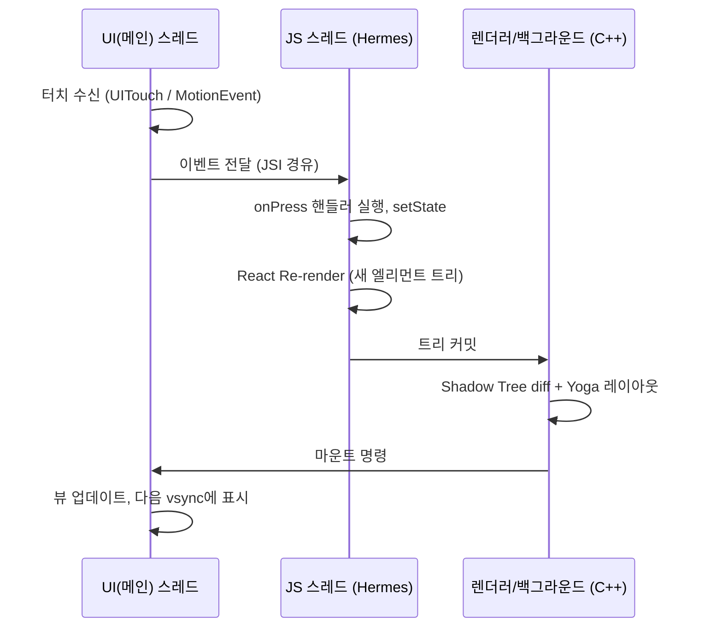
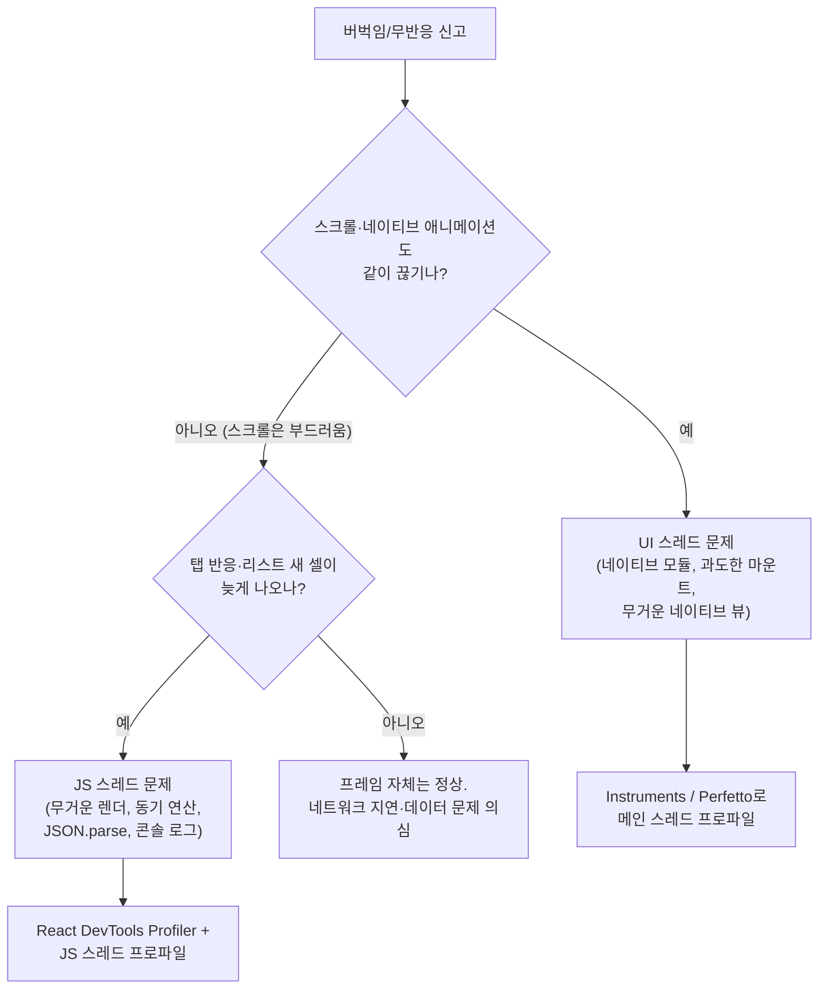

# 스레드 모델

> [!abstract] 한 줄 요약
> RN은 UI(메인) 스레드, JS 스레드, 백그라운드 스레드가 분업하는 구조다. 핵심 계율: **JS 스레드에서 무거운 연산은 네이티브에서 메인 스레드를 막는 것과 같은 죄다.**

## 🔁 iOS-AOS 대응 개념

| RN 스레드 | 역할 | iOS 대응 | Android 대응 |
|---|---|---|---|
| UI(메인) 스레드 | 뷰 생성·마운트, 터치 이벤트 수신, 네이티브 애니메이션, 프레임 그리기 | Main thread + RunLoop | Main/UI thread + Looper·Choreographer |
| JS 스레드 | React 렌더, 비즈니스 로직, 이벤트 핸들러 실행 | 직접 대응 없음 — "앱 로직 전용 serial queue" 하나가 항상 도는 느낌 | HandlerThread 하나에 앱 로직을 전부 태운 느낌 |
| 백그라운드 스레드(들) | [[Yoga]] 레이아웃 계산 등 렌더러 내부 작업, 모듈별 워커 | GCD background queue | 스레드풀 / worker thread |

역할 배분을 한 줄씩 정리하면:

- **UI 스레드**: 네이티브 앱의 메인 스레드 그대로. RN이 추가로 시키는 일은 [[Fabric]] 마운트(뷰 생성·속성 적용)뿐이다.
- **JS 스레드**: [[Hermes]] VM이 도는 전용 스레드. `onPress` 핸들러, `setState`, React [[Re-render]], 네트워크 응답 후처리 — 앱 로직의 거의 전부가 여기서 순차 실행된다.
- **백그라운드**: 렌더러가 [[Shadow Tree]] diff와 [[Yoga]] 계산을 UI/JS 어느 쪽도 막지 않고 수행하는 작업 공간. 개별 [[Turbo Module]]도 자체 워커 스레드/큐를 가질 수 있다.

네이티브 개발자에게 가장 낯선 점: **앱 로직 전체가 단 하나의 JS 스레드에서 순차 실행된다.** JS 언어 자체가 싱글 스레드 이벤트 루프 모델이기 때문이다. "DispatchQueue를 하나 더 만들어 분산"하는 익숙한 해법이 JS 안에는 기본적으로 없다 (예외가 [[Worklet]] — 아래 참조).

## 🧭 왜 이렇게 설계됐나

- **UI 스레드 보호**: JS 실행 속도는 예측이 어렵다(GC, 동적 타입, 앱마다 다른 코드량). JS를 메인 스레드에서 돌리면 JS가 느릴 때마다 프레임이 죽는다. 그래서 JS를 별도 스레드로 격리하고, UI 스레드는 "이미 계산이 끝난 마운트 명령"만 수행하게 했다.
- **JS는 싱글 스레드라는 전제**: JS 생태계 전체(이벤트 루프, async/await, 클로저 캡처 규칙, 라이브러리들의 암묵적 가정)가 싱글 스레드 전제로 만들어져 있다. RN은 이를 바꾸는 대신, 스레드 경계를 JS *바깥*(네이티브/C++)에 두었다.
- **레이아웃은 어느 쪽도 아닌 곳에서**: [[Yoga]] 계산은 C++이라 JS 스레드도 UI 스레드도 막지 않는 백그라운드에서 돌 수 있다. 나아가 [[Fabric]]은 필요 시 UI 스레드에서 **동기** 레이아웃도 가능하게 설계됐다 — 구 아키텍처에서는 불가능했던 것 ([[03-구아키텍처-Bridge]]).

## ⚙️ 동작 원리

### 터치 한 번의 여행



터치가 화면 변화로 이어지려면 **반드시 JS 스레드를 한 번 왕복**해야 한다. 이 왕복이 RN 반응성의 급소다. 네이티브에서는 터치 수신과 뷰 갱신이 같은 메인 스레드에서 끝나므로 이 왕복 자체가 존재하지 않는다 — RN을 프로파일링할 때 가장 먼저 체화해야 할 차이다.

### JS 스레드가 막히면 — 무엇이 멈추고 무엇이 도는가

JS 스레드에서 300ms짜리 동기 루프가 돌고 있다고 하자.

**멈추는 것 (JS 왕복이 필요한 모든 것):**

- 버튼 탭 반응 — `onPress`가 이벤트 큐에서 대기
- `setState`로 인한 화면 갱신, 새 데이터 표시
- JS 기반 애니메이션 (`Animated` 중 `useNativeDriver`를 안 쓴 것)
- 내비게이션 전환의 JS 처리분 (다음 화면의 첫 렌더)
- [[FlatList]]의 새 아이템 렌더 — 스크롤 제스처는 되는데 **빈 셀(blank area)**이 보이는 현상이 정확히 이것
- 타이머 콜백 (`setTimeout`이 밀림)

**계속 도는 것 (네이티브가 자체 처리):**

- 네이티브 드리븐 애니메이션 (`useNativeDriver: true`, 또는 [[Reanimated]])
- 스크롤 제스처 자체 — 스크롤 뷰는 네이티브 컴포넌트라 관성 스크롤은 UI 스레드가 처리
- `TextInput`의 키 입력 표시 — 네이티브 위젯 자체 동작
- 동영상 재생, 네이티브 로딩 인디케이터 회전
- 이미 화면에 올라간 뷰의 표시 자체 (화면이 하얗게 되진 않는다)

이 비대칭이 만드는 착시:

- "스크롤은 부드러운데 탭이 씹힌다" → JS 스레드가 바쁘다는 신호
- "앱이 안 죽었는데 아무 반응이 없다" → JS 스레드 블로킹. 네이티브 ANR/워치독과 달리 시스템이 죽여주지도 않는다
- 네이티브에서 메인 스레드 행이 걸리면 **모든 게** 멈추는 것과 달리, RN은 반쪽만 멈춰서 원인 파악이 헷갈릴 수 있다

### 멘탈모델: "JS 스레드 = 제2의 메인 스레드"

네이티브에서 `viewDidLoad`에 동기 네트워크 호출을 넣지 않듯이, RN에서는 이벤트 핸들러와 렌더 경로에 무거운 동기 연산을 넣지 않는다. 판정 기준도 동일하게 가져가면 된다:

> 한 번에 16ms(60fps) / 8ms(120fps) 이상 JS 스레드를 점유하는 동기 작업은 프레임 드랍 후보다.

주의: `async/await`는 스레드를 바꿔주지 않는다.

- `await fetch(...)` 중 네트워크 I/O 자체는 네이티브에서 돈다.
- 그러나 응답을 받은 뒤의 `JSON.parse`와 후처리는 다시 JS 스레드의 동기 작업이다.
- GCD처럼 "다른 큐로 던지기"가 아니라 "나중에 이 스레드에서 이어서 실행하기"일 뿐이다. `await` = `dispatch_async(global)`이 아니라 "RunLoop에 양보 후 재개"에 가깝다.

### Reanimated Worklet — 예외적으로 UI 스레드에서 도는 JS

[[Reanimated]]는 [[Worklet]]이라는 장치로 이 구조에 구멍을 하나 뚫는다:

- 특정 JS 함수를 **UI 스레드에 상주하는 별도의 소형 JS 런타임**에 복사해 둔다.
- 제스처 이벤트/애니메이션 프레임마다 그 함수를 UI 스레드에서 직접 실행한다.
- 즉 "이 코드만큼은 JS 스레드 왕복 없이 프레임에 동기"가 된다.

```js
const style = useAnimatedStyle(() => {
  'worklet'; // 이 함수는 UI 스레드의 별도 런타임에서 실행됨
  return { transform: [{ translateX: offset.value }] };
});
```

왜 이래야 하는가:

- 제스처 추적 애니메이션(드래그에 손가락처럼 붙는 UI)은 매 프레임 JS 왕복을 하면 구조적으로 한 프레임 늦고, JS 스레드가 바쁠 땐 뚝뚝 끊긴다.
- Worklet은 왕복 자체를 없앤다. 네이티브 감각으로는 "제스처 핸들링 코드는 메인 스레드에 두는 게 당연"한 것의 RN식 복원이다.
- 대가: Worklet 안에서는 일반 JS 세계의 변수·함수를 마음대로 못 쓴다. 별도 런타임이므로 캡처 가능한 값에 규칙이 있고, JS 스레드 함수를 부르려면 명시적 디스패치(`runOnJS`)가 필요하다.

### 스레드 간 통신 — JSI 개요

스레드 사이의 데이터 교환은 [[New Architecture]]에서 [[JSI]]로 이뤄진다.

- 과거: JSON 문자열로 직렬화해 배치 큐로 넘기는 [[Bridge]] 방식 ([[03-구아키텍처-Bridge]])
- 현재: C++ HostObject를 통해 **JS가 네이티브 객체의 메서드를 직접 호출**. 직렬화 없음, 필요 시 동기 호출 가능.
- 단, "어느 스레드에서 실행되는가"는 여전히 각 모듈의 계약이다. JSI는 통로일 뿐 스레드 안전을 자동 보장하지 않는다 — `jsi::Runtime`을 JS 스레드 밖에서 만지면 크래시한다.
- 상세 구조는 [[04-신아키텍처-JSI-Fabric-TurboModules]].

## 💻 코드 예시: JS 스레드를 막는 코드와 대안

```js
// BAD: 수만 건 리스트를 이벤트 핸들러에서 동기 가공
function onSearch(query) {
  const result = allItems
    .map(expensiveNormalize)        // 항목당 수 ms × 수만 건
    .filter(i => i.name.includes(query))
    .sort(compare);
  setResults(result);               // 이 동안 탭·화면 갱신 전부 멈춤
}
```

```js
// BETTER — 우선순위 순서대로:

// 1) 애초에 JS로 가져오지 않기: 서버 또는 네이티브 저장소(SQLite 등)에서
//    필터·정렬·페이지네이션을 끝내고 결과만 받기. 대부분 이게 정답.

// 2) 쪼개서 양보하며 처리: 청크 단위로 나누고 사이사이 이벤트 루프에 양보
async function processInChunks(items, chunkSize = 500) {
  const out = [];
  for (let i = 0; i < items.length; i += chunkSize) {
    out.push(...items.slice(i, i + chunkSize).map(expensiveNormalize));
    await new Promise(r => setTimeout(r, 0)); // 터치·렌더에 기회를 준다
  }
  return out;
}

// 3) 진짜 CPU 헤비 연산이면: 워커 계열 라이브러리 또는
//    네이티브 Turbo Module로 내려서 백그라운드 스레드에서 계산
```

네이티브 감각 번역: (1)은 "메인 스레드에 데이터 자체를 올리지 않기", (2)는 "RunLoop에 양보하며 배치 처리", (3)은 "GCD/Executor로 오프로딩"이다. JS에서는 (3)의 문턱이 높기 때문에 (1), (2)를 먼저 소진하는 게 순서다.

## 버벅임 진단 플로우

"앱이 버벅인다"는 신고가 오면 스레드 관점으로 이렇게 좁힌다:



경험적 우선순위: RN 앱의 버벅임 신고 대부분은 E(JS 스레드)로 수렴한다. 네이티브 앱에서 "일단 메인 스레드부터 본다"가 국룰이었다면, RN에서는 "일단 JS 스레드부터 본다"로 바꾸면 된다.

## ⚠️ 함정 (Pitfalls)

- **거대 JSON의 `JSON.parse`**: 수 MB 응답을 통째로 파싱하면 그 시간만큼 JS 스레드가 정지한다. 네이티브에서 "메인 스레드 Codable 디코딩"을 피하는 것과 같은 이유. 응답을 쪼개거나 목록 API는 페이지네이션이 답.
- **동기 루프로 리스트 가공**: 위 예시. 특히 `map().filter().sort()` 체이닝은 중간 배열을 계속 만들어 GC 압력까지 더한다.
- **콘솔 로그 남발(dev)**: dev 모드에서 대량 `console.log`는 JS 스레드를 유의미하게 느리게 한다. "dev에서만 느린" 증상의 흔한 원인.
- **"async니까 괜찮다" 착각**: `await`는 양보일 뿐 오프로딩이 아니다. await 이후 후처리 비용은 그대로 JS 스레드 비용이다.
- **JS 애니메이션으로 제스처 추적**: 매 프레임 JS 왕복 구조는 구조적으로 한 박자 늦는다. 제스처 연동 애니메이션은 [[Reanimated]]([[Worklet]]) 또는 `useNativeDriver: true`가 기본기.
- **Worklet 안에서 아무 함수나 호출**: Worklet은 별도 런타임이다. 일반 JS 함수를 직접 부르면 에러가 나고, `runOnJS`로 명시적으로 넘겨야 한다. 반대로 Worklet에서 무거운 계산을 하면 이번엔 **UI 스레드**를 막는다.
- **UI 스레드도 성역이 아니다**: 네이티브 모듈이 UI 스레드에서 무거운 일을 하면 네이티브 앱과 똑같이 전체가 멈춘다. RN이라고 메인 스레드 규율이 면제되지 않는다.
- **프로파일링 시 스레드 구분**: Instruments/Perfetto에서 JS 스레드(이름에 `mqt_js` 등 RN 특유의 명칭이 붙음 — 버전별 명칭은 공식 문서 확인)와 메인 스레드를 구분해서 봐야 병목 주체를 특정할 수 있다. "어느 스레드가 바쁜가"가 진단의 첫 질문이다.

## 스레드별 하지 말 것 / 해야 할 것

| 스레드 | 하지 말 것 | 해야 할 것 |
|---|---|---|
| JS 스레드 | 16ms 넘는 동기 연산, 거대 `JSON.parse`, 렌더 경로의 무거운 계산 | 로직·상태 관리, 가벼운 이벤트 처리, 데이터는 쪼개거나 밖으로 |
| UI 스레드 (네이티브 모듈 작성 시) | 디스크/네트워크 I/O, 무거운 이미지 처리 | 뷰 조작만. 나머지는 워커로 |
| Worklet (UI 스레드 JS) | 무거운 계산, 일반 JS 함수 직접 호출 | 프레임당 스타일 계산 같은 초경량 로직만 |
| 백그라운드 (Turbo Module 워커) | JS 값(`jsi::Runtime`) 직접 접근 | 순수 계산·I/O 후 결과만 JS 스레드로 전달 |

## 📌 핵심 요약 3줄

1. 앱 로직 전체가 단 하나의 JS 스레드에서 순차 실행된다 — 여기가 "제2의 메인 스레드"다.
2. JS 스레드가 막히면 탭·상태 갱신이 멈추고, 네이티브 드리븐 애니메이션·스크롤은 계속 돈다 — 이 비대칭이 진단의 열쇠다.
3. 프레임에 동기여야 하는 코드([[Worklet]])만 예외적으로 UI 스레드에서 돌린다.

## 🔗 관련 노트

- [[01-앱-실행-시퀀스]] — 시작 시 각 스레드가 언제 생기고 무엇을 하는지
- [[03-구아키텍처-Bridge]] — 과거의 스레드 간 통신 방식과 그 병목
- [[04-신아키텍처-JSI-Fabric-TurboModules]] — JSI 기반 통신의 실제 구조
- [[05-Metro와-Hermes와-Yoga]] — JS 스레드 위에서 도는 엔진(Hermes)의 특성
