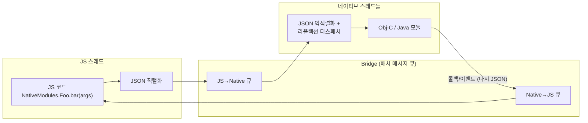
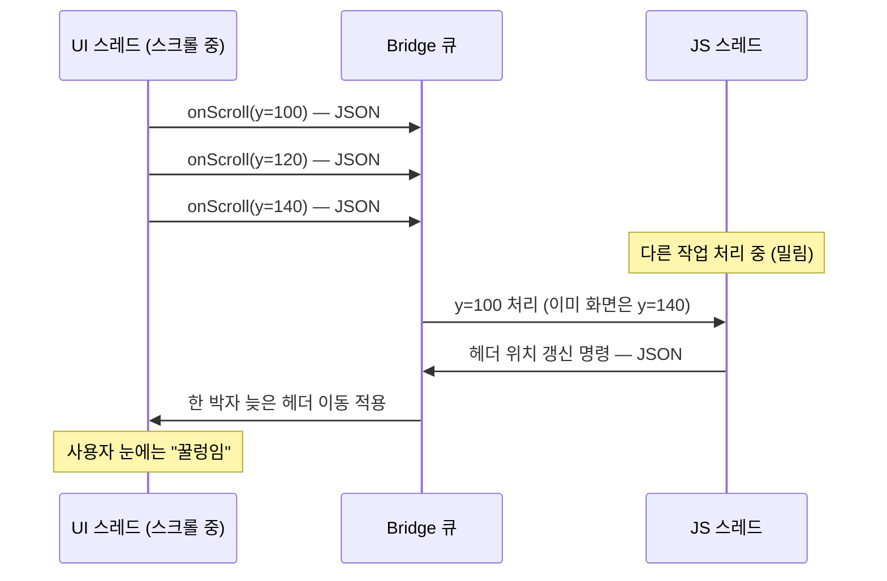

# 구 아키텍처: Bridge

> [!abstract] 한 줄 요약
> 2015~2022년의 RN: JS와 네이티브가 **JSON으로 직렬화된 메시지를 비동기 배치 큐**로 주고받던 구조. 지금은 [[Bridgeless]]로 대체됐지만, 옛 블로그·라이브러리·스택오버플로를 읽어내려면 반드시 알아야 하는 역사다.

## 🔁 iOS-AOS 대응 개념

| Bridge 개념 | 네이티브 개발자용 비유 |
|---|---|
| [[Bridge]] 자체 | 두 프로세스가 JSON을 소켓으로 주고받는 IPC. 실제로는 한 프로세스 안이지만 **격리 수준이 IPC급**이었다 |
| 메시지 배치 큐 | `dispatch_async`로만 통신 가능한 두 큐. 동기 호출(= `dispatch_sync`류)이 계약에 아예 없음 |
| JSON 직렬화 | 모든 파라미터를 `NSJSONSerialization`/`JSONObject`로 왕복 변환 — 매 호출마다 |
| NativeModules | Obj-C/Java 메서드를 문자열 이름으로 노출하는 원격 프록시. 리플렉션 기반 디스패치 |
| 배치 플러시 | 프레임 주기에 맞춰 큐를 모아 한 번에 전송 — Choreographer 콜백에 메시지를 몰아 보내는 느낌 |
| UIManager (구) | JS의 뷰 명령을 해석해 UIKit/View를 조작하는 중앙 디스패처 — 플랫폼별로 각각 구현돼 있었다 |

## 🧭 왜 이렇게 만들어졌었나 (2015년의 설계 배경)

당시의 제약과 목표를 알면 합리적인 선택이었다.

- **JS 엔진이 블랙박스였다**: iOS는 JavaScriptCore를 쓸 수밖에 없었고(App Store 정책상 JIT 없는 임베디드 모드), 엔진 내부 객체를 네이티브에서 직접 조작하는 안정적인 공용 API가 없었다. 엔진과 무관하게 동작하려면 "문자열(JSON)만 주고받기"가 가장 안전한 최소 공통분모였다.
- **비동기 = 미덕이라는 철학**: 페이스북은 "네이티브가 JS를 기다리며 블로킹되는 일이 없어야 한다"를 원칙으로 삼았다. 모든 통신을 비동기로 강제하면 어느 쪽도 서로를 멈출 수 없다 — 이론상으로는.
- **배치 최적화**: 호출마다 상대 스레드를 깨우는 대신, 메시지를 모아 프레임 단위로 플러시하면 컨텍스트 스위칭 비용이 준다.
- **웹 개발자 친화**: React DOM의 "렌더러가 알아서 DOM을 조작"하는 모델을 그대로 이식하기에, 선언적 명령을 큐로 밀어 넣는 구조가 자연스러웠다.
- **디버깅 부수효과**: 통신이 전부 JSON 메시지였기에 큐를 들여다보면 모든 통신을 로깅/재생할 수 있었다. (Chrome 원격 디버깅이 "JS를 크롬에서 돌리고 메시지만 기기로 보내는" 방식으로 가능했던 것도 이 구조 덕이다.)

즉 Bridge는 "무능해서"가 아니라 **당시 가능한 기술로 안전을 최우선한 설계**였다. 문제는 앱들이 커지면서 그 안전 비용이 감당 불가능해진 것이다.

## ⚙️ 동작 원리



### 호출 한 번의 실제 경로

1. JS가 `NativeModules.CameraModule.takePhoto(options, callback)` 호출
2. 인자 전체를 **JSON 직렬화** (콜백 함수는 넘길 수 없으므로 ID 숫자로 치환)
3. `[모듈ID, 메서드ID, 인자들]` 형태의 메시지가 JS→Native 큐에 쌓이고, 배치 주기에 플러시
4. 네이티브에서 **역직렬화** 후 모듈명·메서드명 테이블을 통해 리플렉션으로 디스패치
5. 결과는 역방향으로 같은 과정 반복: 직렬화 → Native→JS 큐 → 역직렬화 → 콜백 ID로 JS 콜백 실행

UI 업데이트도 완전히 동일한 파이프를 탔다:

- React 렌더 결과가 "뷰 생성/속성 변경/재배치 명령"들로 직렬화되어 큐로 넘어가고,
- 네이티브 UIManager가 이를 해석해 뷰를 조작했다.
- 즉 화면에 뭐 하나 바뀔 때마다 JSON이 경계를 넘고 있었다.

### 왜 병목이었나 — 4가지 구조적 문제

**1. 직렬화 비용이 모든 호출에 붙는다**

- 큰 데이터(사진 메타데이터 목록, 수천 행 쿼리 결과, base64 이미지)를 넘길 때마다 JSON 인코딩+디코딩을 왕복으로 지불했다.
- 네이티브 감각으로: 같은 프로세스 안에서 함수 하나 부르는데 매번 IPC 마샬링을 하는 셈.
- 참조 전달이 불가능하니 "포인터만 넘기면 될 것"도 복사·변환됐다.

**2. 비동기 강제 — onScroll 이벤트 홍수**

- 스크롤 중 네이티브는 매 프레임 `onScroll` 이벤트를 만들어 큐에 넣는다.
- JS 스레드가 조금이라도 밀리면 이벤트가 큐에 적체되고, JS는 이미 지나간 스크롤 위치를 뒤늦게 처리한다.
- 증상: 스크롤 위치에 연동된 헤더 축소/패럴랙스가 **한 박자 늦게 꿀렁거림**. 스크롤을 멈추면 그제서야 따라잡는다.
- 이 문제가 `scrollEventThrottle` 튜닝, `useNativeDriver`, 그리고 [[Reanimated]] 탄생의 직접적 배경이다.

이벤트 홍수를 시퀀스로 보면:



**3. 동기 측정 불가 — 깜빡임(flicker)**

- 네이티브에서 `view.frame`을 읽듯, JS가 "이 뷰 실제 크기 얼마야?"를 **동기로** 물을 방법이 없었다.
- `measure()`는 콜백으로만 응답했고, 그 사이 최소 한 프레임이 지나간다.
- 결과: 측정값에 의존하는 UI(툴팁 위치 잡기, 동적 높이 계산)가 "일단 그렸다가 다음 프레임에 고쳐 그리는" 깜빡임을 피할 수 없었다.
- 네이티브라면 `layoutSubviews` 안에서 읽고 바로 반영하면 끝나는 일이었다.

**4. 시작 시 전 모듈 초기화**

- NativeModules는 앱 시작 시 등록된 모든 네이티브 모듈의 정보 테이블(이름·메서드·시그니처)을 만들고 모듈을 준비시키는 구조였다.
- 안 쓰는 모듈도 시작 비용에 포함 — 모듈 수십 개인 대형 앱에서 TTI를 갉아먹는 고정 비용.
- [[Turbo Module]]의 lazy 초기화가 정확히 이 문제의 해독제다.

## 💻 코드 예시: 레거시 API의 모양

옛 코드/블로그에서 이런 패턴을 보면 "구 아키텍처 시대 코드"라고 읽으면 된다.

```js
// 레거시 JS 쪽: NativeModules 직접 접근 (구 아키텍처의 상징)
import { NativeModules, NativeEventEmitter } from 'react-native';

const { CalendarModule } = NativeModules;          // 문자열 기반 원격 프록시
CalendarModule.createEvent('Party', 'My House');    // 반환값 없음 — 결과는 콜백/Promise로만

CalendarModule.getEventCount((count) => {           // 값 하나 읽는 데도 콜백
  console.log(count);
});

const emitter = new NativeEventEmitter(NativeModules.CalendarModule);
emitter.addListener('EventReminder', handleReminder); // 이벤트도 Bridge 경유
```

```objc
// 레거시 iOS 쪽: Obj-C 매크로 — 옛 튜토리얼의 단골
@implementation CalendarModule
RCT_EXPORT_MODULE();
RCT_EXPORT_METHOD(createEvent:(NSString *)name location:(NSString *)location) { ... }
@end
```

```java
// 레거시 Android 쪽
public class CalendarModule extends ReactContextBaseJavaModule {
  @ReactMethod
  public void createEvent(String name, String location) { ... }
}
```

읽는 법:

- `RCT_EXPORT_METHOD` / `@ReactMethod` = "이 메서드를 Bridge에 문자열로 등록"
- 반환 타입이 없고 전부 콜백/Promise인 것 = 비동기 강제의 흔적
- `NativeModules.X`는 지금도 하위 호환(interop layer)으로 동작하는 경우가 많지만, 신규 코드는 [[Turbo Module]] 방식이 표준이다.

## 지금 이걸 배우는 이유 — 역사적 문해력

- **옛 자료 판독**: 2016~2022년 스택오버플로 답변, 블로그의 "RN은 Bridge 때문에 느리다", "직렬화 오버헤드를 줄여라" 논의는 전부 이 구조 얘기다. 지금 그대로 적용하면 틀린 결론이 나온다.
- **라이브러리 코드 읽기**: 오래된 라이브러리의 `NativeModules`, `RCT_EXPORT_METHOD`, `ReactContextBaseJavaModule` 코드는 Bridge 시대 산물이다. [[New Architecture]]에서는 interop layer로 돌아가거나 마이그레이션이 필요하다.
- **신 아키텍처의 존재 이유 이해**: [[JSI]]·[[Fabric]]·[[Turbo Module]]·[[Codegen]]의 설계 결정 하나하나가 위 병목 1~4의 정확한 해독제다. 병을 알아야 약이 이해된다 — [[04-신아키텍처-JSI-Fabric-TurboModules]].
- **팀 커뮤니케이션**: "왜 New Architecture로 갔나", "이 라이브러리 신아키 지원하나"는 RN 팀에서 여전히 일상 대화 주제다.

### 연표로 보는 아키텍처 전환

| 시기 | 사건 |
|---|---|
| 2015 | RN 공개 — Bridge 구조로 출발 |
| 2018 | 페이스북이 재아키텍처 계획 공개 ([[JSI]]/[[Fabric]]/[[Turbo Module]]) |
| 2019~2021 | [[Hermes]] 공개·확산, JSI 기반 라이브러리([[Reanimated]] v2 등) 등장 |
| 2022 | RN 0.68 — [[New Architecture]] opt-in 공개 |
| 2024 | RN 0.76 — New Architecture + [[Bridgeless]] **기본값** |

이 사이(특히 2022~2024)의 자료는 신구가 뒤섞여 있어 가장 혼란스러운 구간이다. 자료를 읽을 땐 반드시 작성 시점과 RN 버전을 확인할 것.

## Bridge 시대 생존 용어집 — 옛 자료에서 마주칠 단어들

| 용어 | 뜻 | 지금의 위상 |
|---|---|---|
| `useNativeDriver` | Animated 값 갱신을 Bridge 왕복 없이 네이티브에서 돌리는 옵션 | 여전히 유효한 개념. [[Reanimated]]가 상위 호환 |
| `scrollEventThrottle` | onScroll 이벤트 발행 주기 제한 (홍수 방지) | 신아키에서 부담이 줄었지만 API는 존속 |
| `batchedBridge` / MessageQueue | Bridge의 배치 큐 구현체 이름 | 사라짐. 디버깅 로그에서나 보이던 이름 |
| `RCTBridge` / `ReactInstanceManager` | 구 아키텍처의 호스트 객체 (iOS/Android) | [[Bridgeless]] 호스트로 대체 |
| "Debug JS Remotely" | JS를 크롬에서 실행하고 메시지만 기기로 전달하던 디버깅 | 폐지. Hermes 직접 연결 디버거로 대체 |
| `removeClippedSubviews` | 화면 밖 뷰를 네이티브 계층에서 떼어 메모리 절약 | 존속. [[FlatList]] 최적화 옵션으로 여전히 등장 |
| "Bridge congestion/traffic" | 큐 적체로 인한 지연 현상 일반 | 신아키에서는 원인 자체가 소멸 |

옛 스택오버플로 답변에서 이 단어들이 보이면 "구 아키텍처 전제의 답"이라는 신호로 읽고, 현재 버전 문서와 교차 확인하라.

## ⚠️ 함정 (Pitfalls)

- **옛 성능 조언의 유통기한**: "Bridge 트래픽을 줄여라"류 최적화 팁(이벤트 스로틀링 강박, 통신 횟수 최소화 설계 등)은 [[Bridgeless]]에서 중요도가 달라졌다. 조언의 작성 연도를 반드시 확인.
- **"Bridge = 프로세스 분리" 오해**: JS와 네이티브는 같은 프로세스다. 격리는 스레드+직렬화 수준이었지 프로세스 수준이 아니다.
- **"비동기라 안전했다"의 이면**: 어느 쪽도 서로를 블로킹하지 않는 대신 **순서와 타이밍 보장이 약했다**. "측정하고 → 그 값으로 그리기" 같은 패턴이 구조적으로 불가능했던 이유.
- **NativeModules가 아직 보인다고 놀라지 말 것**: 신 아키텍처에도 하위 호환 interop layer가 있어 상당수 레거시 모듈이 그대로 돈다. "코드에 보인다 = 구 아키텍처로 돌고 있다"가 아닐 수 있으니 라이브러리 문서 확인.
- **Chrome 원격 디버깅 자료**: "Debug JS Remotely"(JS를 크롬에서 실행) 관련 옛 자료는 Bridge 구조 전제다. JSI 기반 현재 구조에서는 그 방식 자체가 사라졌고, [[Hermes]] 직접 연결 방식의 디버거로 대체됐다.
- **"RN은 느리다" 일반화**: 2016~2019년의 벤치마크·비판 글 상당수는 Bridge 병목 측정이다. 현재 아키텍처 평가로 인용하면 곤란하다.

## 📌 핵심 요약 3줄

1. Bridge = 같은 프로세스 안에서 JSON 직렬화 + 비동기 배치 큐로만 통신하던 IPC급 격리.
2. 4대 병목: 직렬화 비용, 비동기 강제(이벤트 적체·측정 깜빡임), 전 모듈 초기화, 문자열 디스패치의 런타임 오류.
3. 지금 배우는 이유는 향수가 아니라 문해력 — 2015~2022년 자료·라이브러리를 올바르게 읽기 위해서다.

## 🔗 관련 노트

- [[04-신아키텍처-JSI-Fabric-TurboModules]] — 이 병목들을 어떻게 해결했나
- [[02-스레드-모델]] — Bridge가 강제했던 비동기 스레드 경계
- [[01-앱-실행-시퀀스]] — 구조 전환 후의 현재 실행 경로
- [[05-Metro와-Hermes와-Yoga]] — Bridge 시대에도 동일했던 도구 층
