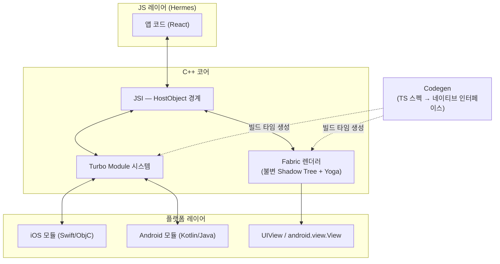
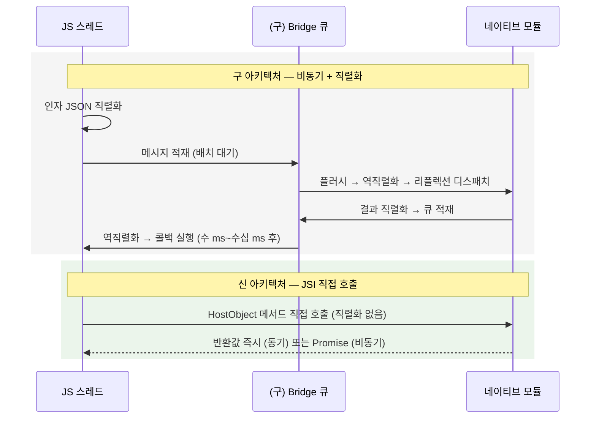

# 신 아키텍처: JSI · Turbo Module · Fabric · Codegen

> [[New Architecture]] = [[JSI]](직접 호출 통로) + [[Turbo Module]](lazy 네이티브 모듈) + [[Fabric]](C++ 렌더러) + [[Codegen]](타입 계약 생성기). RN 0.76부터 기본값이며, [[Bridge]]의 직렬화·비동기 강제·전체 초기화 문제를 각각 정확히 겨냥한 해독제다.

## iOS-AOS 대응 개념

| 신 아키텍처 요소 | 네이티브 개발자용 비유 |
|---|---|
| [[JSI]] | JSON IPC를 걷어내고 **C++ 헤더를 직접 링크**한 것. JS가 vtable 너머의 C++ 객체 메서드를 그냥 부른다 |
| [[Turbo Module]] | `dispatch_once` lazy 싱글턴 레지스트리. 첫 접근 때만 생성되는 서비스 로케이터 |
| [[Fabric]] | UIKit/View 시스템 위에 얹힌 크로스플랫폼 렌더 코어. 불변 트리 기반이라 CALayer 트리의 커밋-트랜잭션 모델과 발상이 유사 |
| [[Codegen]] | 인터페이스 정의에서 스텁을 생성하는 protobuf/AIDL식 접근. TS 스펙 파일 = `.proto` 파일 격 |
| [[Bridgeless]] | Bridge 없이 위 요소들만으로 도는 런타임 모드 — "레거시 IPC 데몬을 완전히 내린 상태" |
| C++ 코어 | iOS/Android가 **같은 렌더러 구현을 공유** — 플랫폼별 UIManager 재구현의 종말 |

## 왜 이렇게 설계됐나

[[03-구아키텍처-Bridge]]의 4대 병목과 1:1로 대응된다:

| Bridge 병목 | 해결한 요소 | 방법 |
|---|---|---|
| 모든 호출에 JSON 직렬화 | [[JSI]] | 직렬화 제거 — 값·객체 참조를 직접 주고받음 |
| 비동기 강제 (측정 깜빡임, 이벤트 적체) | [[JSI]] + [[Fabric]] | 동기 호출 가능, 동기 레이아웃 측정 가능 |
| 시작 시 전 모듈 초기화 | [[Turbo Module]] | 첫 사용 시점까지 lazy 초기화 |
| 문자열 기반 호출의 런타임 타입 오류 | [[Codegen]] | 빌드 타임에 타입 불일치 검출 |

추가 목표도 있었다:

- **엔진 독립**: JSI라는 추상층 덕에 JavaScriptCore → [[Hermes]] 교체가 가능해졌다.
- **플랫폼 일관성**: 렌더 로직을 C++ 하나로 통일해 iOS/Android 동작 차이를 구조적으로 줄였다.
- **React 18 대응**: concurrent rendering(우선순위 기반 렌더)을 받으려면 렌더러가 불변 트리 기반이어야 했다.

## 동작 원리

### 전체 구조



### 1. JSI — JavaScript Interface

JSI는 **JS 엔진을 추상화하는 얇은 C++ API**다. 핵심 개념은 `HostObject`:

- C++ 객체를 JS 세계에 노출하면, JS에서 그 프로퍼티/메서드에 접근할 때 C++ 코드가 **그 자리에서 직접** 실행된다.
- 반대로 네이티브도 JS 값(`jsi::Value`, `jsi::Object`, `jsi::Function`)을 직접 만들고 호출할 수 있다.

멘탈모델: **"JS와 네이티브가 같은 메모리 공간에서 객체를 주고받는다."**

- Bridge 시절: 옆 건물에 팩스 보내기 — 문서(JSON)로 변환하고, 전송하고, 다시 타이핑
- JSI: 같은 사무실에서 어깨 두드리기 — 객체를 가리키며 "이거 처리해줘"

특성 정리:

- **직렬화 없음**: 값이 JSON 문자열로 변환되지 않고 JSI 타입으로 경계를 넘는다. 큰 배열도 참조 수준으로 다뤄진다.
- **동기 호출 가능**: JS가 네이티브 함수를 부르고 반환값을 그 줄에서 받을 수 있다. (남용 금지 — 동기 호출 동안 JS 스레드가 대기한다.)
- **엔진 독립**: JSI 위에서는 [[Hermes]]든 JavaScriptCore든 동일하게 동작한다. Hermes 채택을 가능하게 한 토대다.
- **스레드 안전은 별개**: JSI 자체는 스레드 안전을 보장하지 않는다. "어느 스레드에서 부르는가"는 여전히 모듈 설계자의 책임 ([[02-스레드-모델]]).

[[Reanimated]]의 [[Worklet]], 고성능 스토리지 라이브러리들(동기 key-value 접근) 등이 전부 JSI 위에서 성립한 물건들이다 — Bridge 시절엔 불가능했던 부류다.

### 2. Turbo Module

네이티브 모듈 시스템의 세대교체:

- **Lazy 초기화**: 구 NativeModules는 앱 시작 시 모든 모듈을 준비했지만, Turbo Module은 JS가 처음 `TurboModuleRegistry.get('Foo')` 할 때 생성된다.
    - 모듈 50개짜리 앱에서 첫 화면이 3개만 쓴다면 3개만 초기화된다 → TTI 개선.
    - `dispatch_once` lazy 싱글턴, Dagger의 lazy provider와 같은 발상.
- **JSI 기반 호출**: 메서드 호출이 JSON 큐가 아니라 HostObject를 통해 직접 이뤄진다.
- **동기 메서드 선언 가능**: 설정값 읽기 같은 즉답형 API를 동기로 노출할 수 있다.
- **스펙 기반**: 모듈의 인터페이스를 TS 스펙 파일로 강제하고, [[Codegen]]이 네이티브 쪽 프로토콜/인터페이스를 생성한다.

### 3. Fabric

렌더러의 전면 재작성. 핵심 설계:

- **C++ 코어 공유**: 트리 diff, 레이아웃 트리거, 마운트 명령 생성이 C++ 하나로 iOS/Android 공통. 구 아키텍처에서는 UIManager가 플랫폼별로 따로 구현돼 미묘한 동작 차이가 났다.
- **불변(immutable) [[Shadow Tree]]**: 렌더마다 기존 트리를 수정하는 게 아니라 새 버전의 불변 트리를 만들어 diff한다.
    - 불변이므로 **여러 스레드에서 잠금 없이 안전하게 읽을 수 있다.**
    - 진행 중인 렌더를 버리고 더 급한 렌더(사용자 입력 반응)를 먼저 처리하는 **우선순위 기반 렌더링**(React 18 concurrent features)이 가능해진다.
    - CALayer의 model/presentation 분리나 "커밋 전까지는 트랜잭션"이라는 감각과 통한다.
- **동기 레이아웃 측정**: UI 스레드가 필요할 때 Shadow Tree에 동기로 레이아웃을 질의/계산할 수 있다. Bridge 시절 측정 깜빡임 문제 ([[03-구아키텍처-Bridge]]의 병목 3)의 종결.
- 레이아웃 계산 자체는 여전히 [[Yoga]]가 담당한다 ([[05-Metro와-Hermes와-Yoga]]).

렌더 3단계로 정리하면:

1. **Render**: JS에서 React가 새 엘리먼트 트리 생성 → C++에서 새 Shadow Tree 버전 생성
2. **Commit**: [[Yoga]] 레이아웃 계산 후 "이 트리가 다음 화면"으로 확정, 이전 트리와 diff
3. **Mount**: UI 스레드에서 diff만큼 네이티브 뷰 생성·갱신·제거

### 4. Codegen

빌드 타임 도구. TS(또는 Flow)로 쓴 스펙 파일을 읽어 네이티브 인터페이스 코드를 생성한다.

- iOS: 프로토콜/템플릿 코드 생성 → 모듈이 이를 준수(conform)해야 컴파일 통과
- Android: 추상 클래스/인터페이스 생성 → 상속 구현 강제
- 뷰 컴포넌트용 스펙(`*NativeComponent.ts`)과 모듈용 스펙(`Native*.ts`) 두 종류가 있다
- 실행 시점: iOS는 `pod install`, Android는 Gradle 빌드 과정에서 생성

효과: JS가 기대하는 시그니처와 네이티브 구현이 어긋나면 **런타임 크래시가 아니라 빌드 에러**가 된다. AIDL이나 protobuf처럼 스키마로 양단을 묶는 발상이다. Bridge 시절엔 문자열 기반 디스패치라 오타·타입 불일치가 런타임에 `undefined`로 조용히 흘렀다.

## 코드 예시: Turbo Module 스펙

```ts
// specs/NativeCalendar.ts — 이 파일이 "계약서"다
import type { TurboModule } from 'react-native';
import { TurboModuleRegistry } from 'react-native';

export interface Spec extends TurboModule {
  createEvent(name: string, location: string): Promise<number>;
  getDeviceCalendarCount(): number; // 동기 메서드도 선언 가능
}

export default TurboModuleRegistry.getEnforcing<Spec>('NativeCalendar');
```

```json
// package.json — Codegen에게 스펙 위치를 알려주는 선언
{
  "codegenConfig": {
    "name": "NativeCalendarSpec",
    "type": "modules",
    "jsSrcsDir": "specs"
  }
}
```

빌드 시 [[Codegen]]이 이 스펙에서 iOS 프로토콜과 Android 추상 클래스를 생성하고, 네이티브 개발자는 그것을 구현한다. `createEvent`의 두 번째 인자를 네이티브에서 숫자 타입으로 구현하면 빌드가 깨진다 — 예전엔 런타임에 조용히 `undefined`가 흐르던 상황이다.

## Bridge vs JSI — 호출 하나의 경로 비교



같은 `getDeviceCalendarCount()` 하나가 구 구조에서는 "직렬화 → 큐 → 배치 플러시 → 역직렬화 → 콜백"의 왕복이었고, 신 구조에서는 함수 호출 한 번이다. 네이티브 감각으로는 XPC 호출이 그냥 메서드 호출로 바뀐 것.

## 라이브러리 호환성 관점

- **RN 0.76부터 New Architecture + [[Bridgeless]]가 기본값**이다 (0.68~0.75는 opt-in 과도기). 신규 프로젝트는 사실상 신 아키텍처만 고려하면 된다.
- 구 아키텍처용 라이브러리도 **interop layer** 덕에 상당수 그대로 동작한다. 다만:
    - 성능 이점(동기 호출, lazy 초기화)은 못 누린다.
    - 커스텀 뷰 컴포넌트 쪽은 미묘한 렌더 차이 등 엣지 케이스가 있을 수 있다.
- 라이브러리 선택 시 신아키 지원 확인법:
    - [reactnative.directory](https://reactnative.directory)에서 "New Architecture" 필터/표시 확인
    - README·CHANGELOG의 New Architecture / Fabric / Turbo Module 언급 확인
    - 코드에 `codegenConfig`(package.json)나 스펙 파일(`Native*.ts`, `*NativeComponent.ts`)이 있으면 신 아키텍처 네이티브 지원
    - GitHub 이슈에서 "new architecture" 검색 — 미지원이면 대개 이슈가 열려 있다
- 유지보수가 멈춘 구 아키텍처 전용 라이브러리는 시한부라고 보면 된다. 도입 전 대체재를 확보할 것.

## 함정 (Pitfalls)

- **"동기 호출 가능 = 동기로 쓰자"가 아니다**: 동기 호출 동안 JS 스레드는 대기한다. 무거운 네이티브 작업을 동기로 노출하면 Bridge 시절보다 나쁜 정지를 만들 수 있다. 동기는 "짧고 즉답 가능한 것"(설정값 읽기, 캐시 조회)에만. 네이티브에서 `dispatch_sync(main)`을 함부로 안 쓰는 감각과 동일.
- **JSI ≠ 스레드 안전**: 같은 메모리 공간이 된 대신, 네이티브에서 JS 값을 잘못된 스레드에서 만지면 크래시한다. `jsi::Runtime` 접근은 JS 스레드에서라는 규율이 필요하다.
- **interop layer 과신**: "구 라이브러리도 돌아간다"는 대체로 참이지만 보장은 아니다. 특히 커스텀 뷰 매니저 계열은 업그레이드 후 화면 회귀 테스트 필수.
- **문서·블로그의 세대 혼동**: "TurboModules는 실험 기능", "Fabric은 아직 프로덕션 부적합" 같은 문장은 2021~2023년 자료다. 항상 RN 버전 기준으로 읽을 것 ([[03-구아키텍처-Bridge]]의 연표 참고).
- **Codegen은 빌드 파이프라인 의존**: 생성 코드는 pod install / Gradle 빌드 때 만들어진다. 스펙 변경 후 네이티브 재빌드 없이 JS만 리로드하면 계약이 어긋난다. "스펙 바꿈 → 네이티브 재빌드"를 한 몸으로 기억.
- **4요소를 개별 선택제로 오해**: JSI/Fabric/Turbo Module/Codegen은 패키지다. 0.76+에서 "Fabric만 끄기" 같은 부분 조합은 지원 시나리오가 아니며, 문제가 있으면 전체 opt-out이 단위다 (그마저도 과도기용).
- **정확한 내부 클래스명 암기 무용**: 내부 구현(호스트 클래스명, 스레드명 등)은 마이너 버전에서도 바뀐다. 구조와 계약을 기억하고, 세부는 그때그때 공식 문서 확인.

## 관련 노트

- [[03-구아키텍처-Bridge]] — 이 설계가 해결한 문제들의 원형
- [[02-스레드-모델]] — JSI 경계와 스레드 규율, Worklet
- [[01-앱-실행-시퀀스]] — Fabric이 실행 파이프라인에서 담당하는 구간
- [[05-Metro와-Hermes와-Yoga]] — Fabric이 위임하는 레이아웃 엔진(Yoga)과 JSI를 가능케 한 엔진(Hermes)
