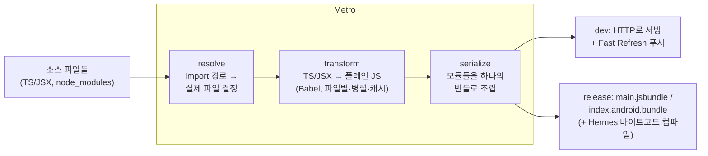
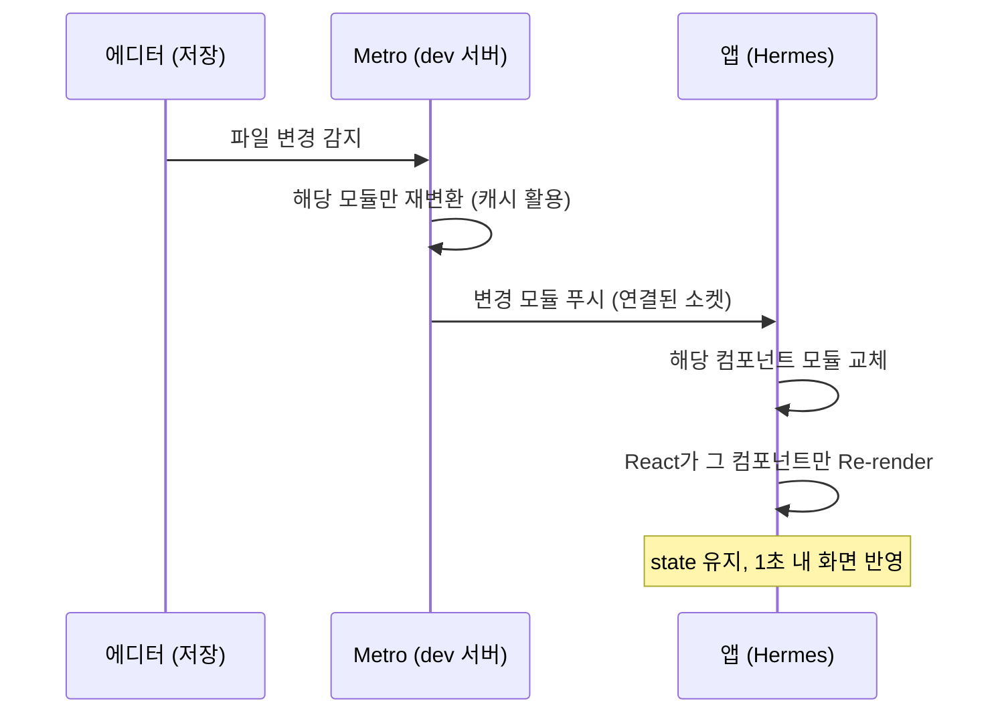

# Metro와 Hermes와 Yoga

> RN을 떠받치는 3대 도구: [[Metro]]는 JS의 빌드 시스템(Xcode 빌드시스템/Gradle의 JS판), [[Hermes]]는 모바일 전용 JS 엔진(AOT 바이트코드), [[Yoga]]는 C++ Flexbox 레이아웃 엔진(Auto Layout/ConstraintLayout의 자리)이다.

## iOS-AOS 대응 개념

| 도구 | 역할 | iOS 대응 | Android 대응 |
|---|---|---|---|
| [[Metro]] | JS 소스 → 번들 변환 + dev 서버 | Xcode Build System (컴파일·링크·증분 빌드) | Gradle + AGP |
| [[Hermes]] | JS 실행 엔진 | 직접 대응 없음 — "바이트코드를 도는 임베디드 경량 런타임" | ART가 dex 바이트코드를 실행하는 관계와 유사 |
| [[Yoga]] | 레이아웃 계산 | Auto Layout 엔진 (Cassowary solver) | `measure`/`layout` 패스 + ConstraintLayout solver |
| [[Fast Refresh]] | 코드 수정 즉시 반영 | SwiftUI Preview가 꿈꾸던 것의 실현판 | Compose Live Edit와 유사 |
| Hermes 바이트코드 | 사전 컴파일 산출물 | 기계어 AOT의 JS판 | dex를 설치 시 AOT 컴파일(ART)하는 것과 동형 |
| [[Bundle]] | 모든 JS를 묶은 단일 산출물 | 링크 완료된 실행 바이너리 격 | 병합된 dex 격 |

세 도구의 관계를 실행 파이프라인([[01-앱-실행-시퀀스]]) 위에 놓으면:

- 빌드 타임: [[Metro]]가 번들을 만들고 (release면 Hermes 바이트코드로 컴파일까지)
- 런타임 초입: [[Hermes]]가 그 번들을 실행하고
- 렌더마다: [[Fabric]]의 위임을 받아 [[Yoga]]가 레이아웃을 계산한다

## 왜 이렇게 설계됐나

세 도구의 공통 배경: **웹의 도구·언어를 모바일 제약(느린 CPU, 제한 메모리, iOS JIT 금지, 콜드 스타트 민감)에 맞게 다시 만든 것**이다.

- 웹팩 같은 웹 번들러는 페이스북 규모 RN 앱의 dev 반복 속도에 부족했다 → Metro (대규모 모노레포 기준으로 설계)
- 범용 JS 엔진(V8, JSC)은 데스크톱·서버 우선 설계라 모바일 콜드 스타트에 불리했다 → Hermes
- 플랫폼 레이아웃 시스템(Auto Layout, ConstraintLayout)은 서로 개념이 달라 크로스플랫폼 일관성이 불가능했다 → Yoga

## 동작 원리

### Metro — JS의 빌드 시스템

파이프라인은 3단계다:



단계별로:

- **resolve**: `import { View } from 'react-native'`가 디스크의 어느 파일인지 결정한다.
    - 플랫폼 분기(`Button.ios.tsx` vs `Button.android.tsx`)도 여기서 일어난다 — 타겟별 소스셋(`src/main` vs flavor, 타겟 멤버십)의 JS판.
    - node_modules 탐색 규칙, alias 설정도 이 단계 소관.
- **transform**: 각 파일을 Babel로 변환한다 (TS 타입 제거, JSX → 함수 호출, 신문법 다운레벨).
    - 파일 단위 병렬 처리 + 디스크 캐시 → 재빌드가 빠르다. 증분 빌드하는 Gradle 데몬을 떠올리면 된다.
- **serialize**: 변환된 모듈 전부를 의존성 순서로 묶어 하나의 [[Bundle]] 파일로 조립한다. 링크 단계에 해당.

**dev 서버 역할**: `npx react-native start`로 뜨는 8081 포트 프로세스가 Metro다.

- 디버그 빌드 앱은 시작 시 여기서 번들을 받는다 ([[01-앱-실행-시퀀스]] 3단계).
- 소스 저장 시 Metro가 변경된 모듈만 다시 변환해 앱에 푸시한다.
- [[Fast Refresh]]가 **앱 재시작도, 네이티브 재빌드도 없이** 해당 React 컴포넌트만 갈아끼운다. 컴포넌트 상태(state)도 가능한 범위에서 보존된다.
- "수정 → ⌘R → 빌드 대기 → 재실행 → 그 화면까지 다시 이동"이라는 네이티브 루프가 "저장 → 1초 내 반영"으로 줄어든다. RN DX의 최대 자산.

주의: Fast Refresh는 **JS만** 해당된다. 네이티브 코드·설정을 건드리면 여전히 Xcode/Gradle 재빌드다 ([[Dev Client]] 재빌드).

Fast Refresh의 동작을 시퀀스로 보면:



### Hermes — RN 전용 JS 엔진

**왜 굳이 엔진을 만들었나.** V8/JSC의 전략은 "일단 시작하고, 뜨거운 코드를 런타임에 JIT으로 최적화"다. 이는 오래 도는 웹 탭·서버에 최적이지만, 모바일 앱의 승부처는 **콜드 스타트 몇백 ms와 메모리 상한**이다. 결정적으로 **iOS는 서드파티 앱의 JIT(쓰기+실행 가능 메모리 페이지)를 정책적으로 금지**하므로, JIT 엔진의 강점이 iOS에서는 원천 봉쇄된다. 그래서 발상을 뒤집었다:

- **AOT 바이트코드 컴파일**: 빌드 타임에 JS를 Hermes 바이트코드로 미리 컴파일해 앱에 내장한다. 런타임에는 파싱도 컴파일도 없이 바이트코드를 바로 인터프리트한다.
    - 시작 시간에서 "JS 파싱+컴파일" 항목이 통째로 사라진다. 번들이 클수록 절감 폭이 크다.
    - dex를 설치 시점에 AOT 컴파일하는 ART의 전략과 정신이 같다.
- **mmap 친화**: 바이트코드 파일을 메모리 매핑해 필요한 페이지만 로드 → 시작 메모리 절감.
- **JIT 없음 = iOS와 완벽한 궁합**: 어차피 iOS에서 못 쓰는 기능을 버리는 대신, 인터프리터 자체와 GC를 모바일 워크로드에 맞게 최적화했다.
- **트레이드오프**: 순수 연산 루프의 피크 성능은 JIT 엔진보다 낮을 수 있다. 그러나 UI 앱의 실제 병목은 시작 시간·메모리·GC 일시정지이고, Hermes는 그 지점을 이긴다.
- 디버깅·프로파일링은 Chrome DevTools 프로토콜 기반 도구로 지원된다 (연결 방식 세부는 버전에 따라 다르니 공식 문서 확인).

RN 0.70부터 기본 엔진이다. [[JSI]] 위에서 동작하므로 이론상 다른 엔진으로 교체 가능하지만([[04-신아키텍처-JSI-Fabric-TurboModules]]), 사실상 표준이다.

### Yoga — C++ Flexbox 엔진

[[Shadow Tree]]의 각 노드에 대해 `x, y, width, height`를 계산하는 C++ 라이브러리. [[Fabric]]이 커밋 단계에서 호출한다 ([[01-앱-실행-시퀀스]] 6단계).

**Auto Layout / ConstraintLayout과의 개념 대응:**

| | 제약 기반 (Auto Layout, ConstraintLayout) | 플로우 기반 (Flexbox / Yoga) |
|---|---|---|
| 사고방식 | "A의 leading = B의 trailing + 8" — 뷰 간 **관계 방정식**을 선언, solver가 연립방정식을 풂 | 컨테이너가 자식을 **방향·비율·정렬 규칙**으로 흘려 배치 — 부모→자식 단방향 |
| 형제 관계 | 임의의 뷰끼리 직접 제약 가능 | 형제는 컨테이너 규칙을 통해서만 관계 맺음 |
| 모호성·충돌 | 제약 부족/충돌 시 런타임 경고 (Unsatisfiable constraints) | 구조상 충돌 개념이 거의 없음 — 규칙이 항상 해를 가짐 |
| 비용 | solver 비용, 제약이 복잡할수록 증가 | 트리 순회 1~2 패스, 예측 가능 |
| 표현력 | 임의 관계 표현에 강함 | 리스트·스택형 UI에 강함, 임의 관계는 절대 좌표·중첩으로 우회 |
| 우선순위 | UILayoutPriority / constraint priority | `flex`, `flexGrow`/`flexShrink` 비율이 그 자리를 대체 |

**왜 Flexbox를 채택했나:**

1. 웹 개발자가 이미 아는 모델 — React 개발자 유입 시 학습 비용이 거의 없다.
2. 명세가 플랫폼 중립 — **iOS와 Android에서 동일한 레이아웃 결과**를 낼 수 있다. 크로스플랫폼 일관성은 RN의 존재 이유다.
3. solver 없는 단방향 플로우 — 성능이 예측 가능하고 구현이 단순하다.

대가로 "임의 뷰 간 제약"의 표현력을 포기했고, 그런 케이스는 중첩 컨테이너나 `position: 'absolute'`로 우회한다.

참고 — Yoga 기본값은 웹 CSS와 미묘하게 다르다:

- `flexDirection` 기본이 웹의 `row`가 아니라 **`column`** (모바일 화면은 세로 흐름이 기본이므로)
- `position` 기본이 `relative`
- 모든 요소가 `box-sizing: border-box` 감각으로 동작

## 코드 예시: 같은 레이아웃, 세 가지 사고방식

```tsx
// Yoga(Flexbox): "가로로 흘리고, 사이 간격 8, 세로 중앙 정렬"
<View style={{ flexDirection: 'row', alignItems: 'center', gap: 8 }}>
  <Image style={{ width: 40, height: 40 }} />
  <Text style={{ flex: 1 }}>제목</Text>   {/* 남는 공간을 전부 차지 */}
  <Text>3분 전</Text>
</View>
```

같은 UI를 다른 시스템으로 짜면:

- **Auto Layout**: leading/trailing/centerY 제약 대여섯 개 + 가운데 라벨의 content hugging/compression resistance 조정
- **ConstraintLayout**: horizontal chain + `layout_constraintHorizontal_weight` 또는 `0dp` 트릭

Yoga에서는 "행 컨테이너의 규칙" 선언으로 끝나고, `flex: 1`이 UILayoutPriority/`layout_weight`의 자리를 대신한다. 사고의 주어가 "뷰 간 관계"에서 "컨테이너의 흐름 규칙"으로 바뀌는 것이 적응의 핵심이다.

Metro의 resolve 단계가 해주는 플랫폼 분기도 코드로 보면:

```
components/
  Button.tsx          // 공통 구현 (기본)
  Button.ios.tsx      // iOS 전용 구현이 필요할 때
  Button.android.tsx  // Android 전용 구현이 필요할 때
```

```tsx
import Button from './components/Button';
// iOS 빌드에서는 Button.ios.tsx가, Android에서는 Button.android.tsx가
// 자동으로 선택된다. 호출부 코드는 하나다.
// 타겟 멤버십/소스셋 분리를 파일명 규약으로 해결하는 방식.
```

## 세 도구 요약 — 누가 언제 일하나

| | [[Metro]] | [[Hermes]] | [[Yoga]] |
|---|---|---|---|
| 일하는 시점 | 빌드 타임 + dev 런타임(서버) | 앱 런타임 내내 | 렌더 커밋마다 |
| 있는 곳 | 개발 머신 (Node.js 프로세스) | 앱 프로세스 (JS 스레드) | 앱 프로세스 (C++, 렌더러 내부) |
| 입력 → 출력 | TS/JSX 소스 → [[Bundle]] | 바이트코드 → 실행 | 스타일 있는 노드 트리 → frame 값들 |
| 문제 생기면 증상 | 빌드 실패, "No bundle URL", 리프레시 안 됨 | JS 크래시, 느린 시작, 메모리 | 의도와 다른 배치, 레이아웃 성능 |
| 네이티브 대응물 | Xcode Build System / Gradle | ART의 바이트코드 실행 | Auto Layout / measure·layout 패스 |
| 교체 가능성 | 사실상 표준 (대안: 서드파티 번들러 일부) | JSI 덕에 이론상 교체 가능, 사실상 표준 | Fabric에 내장, 교체 대상 아님 |

한 줄 요약: **Metro는 만들고, Hermes는 돌리고, Yoga는 배치한다.**

## 함정 (Pitfalls)

- **Metro 캐시 미신과 실제**: "안 되면 `--reset-cache`"는 종종 유효하지만, 매번 리셋하면 transform 캐시 이점을 버리는 것. babel 설정 변경, 의존성 대규모 변경 때만 쓰면 된다.
- **[[Fast Refresh]]의 한계 오해**: JS 밖(네이티브 모듈 추가, 네이티브 설정)은 반영 안 된다. 또 React 컴포넌트가 아닌 모듈을 수정하면 전체 리로드로 폴백되어 상태가 날아갈 수 있다.
- **포트 8081 문제**: Metro가 안 떠 있거나 다른 프로세스가 8081을 점유하면 디버그 앱이 "No bundle URL present" 류 에러로 뜬다. 네이티브 문제가 아니라 dev 서버 문제다.
- **dev에서는 Hermes 이점이 안 보인다**: dev 모드는 Metro가 주는 플레인 JS를 실행하는 경로라, 바이트코드 AOT의 시작 시간 이점은 **release 빌드에서만** 체감된다. 성능 인상은 release로 판단할 것.
- **JS 소스맵 관리**: release 크래시의 JS 스택은 바이트코드/압축 기준이라 소스맵 없이는 못 읽는다. dSYM을 보관하듯, 번들 빌드 산출물의 소스맵을 크래시 리포팅(Sentry 등)에 업로드하는 파이프라인이 필요하다.
- **Yoga ≠ 웹 CSS 전체**: Yoga는 Flexbox(+ 일부 확장)만 구현한다. CSS Grid, float 같은 것은 없다. 웹 경험자와 협업할 때 `flexDirection` 기본값(`column`)을 서로 헷갈리는 것도 단골 사고.
- **깊은 중첩의 비용**: Yoga가 빨라도 노드 수천 개의 깊은 트리는 공짜가 아니다. 특히 [[FlatList]] 셀 내부의 과도한 View 중첩은 레이아웃+마운트 비용을 함께 키운다. Layout Inspector에서 계층 깊이를 의심하던 습관 그대로 유효하다.
- **번들 = 앱 크기라는 착각**: JS 번들/바이트코드는 앱 용량의 일부일 뿐이다. 반대로 "번들은 작은데 시작이 느리다"면 import 구조(초기 실행되는 모듈 양)를 봐야 한다 ([[01-앱-실행-시퀀스]]의 TTI 표).

## 네이티브 개발자를 위한 자가 점검 Q&A

- **Q. Metro는 앱에 포함되나?**
  A. 아니다. 개발 머신에서만 도는 Node.js 프로세스다. release 앱은 Metro가 빌드 타임에 만들어 둔 번들만 들고 다닌다.
- **Q. Hermes를 쓰는지 어떻게 확인하나?**
  A. 프로젝트 설정에서 Hermes 활성화 여부 확인(0.70+ 기본 on). 런타임에서는 `global.HermesInternal` 존재 여부로도 확인 가능하다.
- **Q. TS 타입 체크는 누가 하나?**
  A. Metro는 안 한다 — transform 단계는 타입을 "제거"할 뿐 검사하지 않는다. 타입 체크는 `tsc`/에디터/CI의 몫. "빌드가 됐다 ≠ 타입이 맞다"는 점이 네이티브 컴파일러와 다르다.
- **Q. Yoga 레이아웃 결과를 눈으로 확인하려면?**
  A. 개발 메뉴의 element inspector, 또는 플랫폼 도구(View Hierarchy Debugger / Layout Inspector). 최종 산출물이 네이티브 뷰의 frame이므로 익숙한 도구가 다 통한다.
- **Q. 번들을 여러 개로 쪼갤 수 있나?**
  A. 기본은 단일 번들. 초대형 앱용 분할 로딩 기법이 존재하지만 표준 경로가 아니므로 필요해지면 공식 문서·사례를 확인.

## 관련 노트

- [[01-앱-실행-시퀀스]] — 세 도구가 실행 파이프라인 어디에 꽂히는지
- [[04-신아키텍처-JSI-Fabric-TurboModules]] — Yoga를 구동하는 Fabric, Hermes를 얹는 JSI
- [[02-스레드-모델]] — Hermes(JS 스레드)와 Yoga(백그라운드)의 실행 위치
- [[03-구아키텍처-Bridge]] — 도구 층은 같았지만 통신 층이 달랐던 시절
