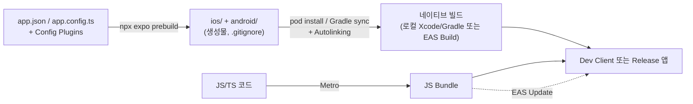

# Expo vs Bare

> 핵심 질문은 하나다: **네이티브 프로젝트(`ios/`, `android/`)를 "소스"로 소유할 것인가, "생성물"로 취급할 것인가.** Expo는 후자([[CNG]]), Bare는 전자다. 그리고 현재 RN 공식 문서는 신규 프로젝트에 프레임워크(=Expo) 사용을 권장한다.

## iOS-AOS 대응 개념

| RN 개념 | iOS 감각 | Android 감각 |
|---|---|---|
| Bare 프로젝트 | Xcode 프로젝트를 직접 소유·수정 | Gradle 프로젝트를 직접 소유·수정 |
| [[CNG]] + [[Prebuild]] | `xcodegen`/`Tuist`로 `.xcodeproj`를 생성물 취급하는 것과 동일한 발상 | Gradle 빌드 스크립트를 템플릿에서 재생성하는 발상 |
| [[Config Plugin]] | Info.plist/entitlements/Podfile 수정을 스크립트로 선언 | AndroidManifest/Gradle 수정을 스크립트로 선언 |
| [[Expo Go]] | 미리 빌드된 범용 시뮬레이터 앱 (TestFlight 데모 앱 느낌) | 스토어에서 받는 범용 호스트 앱 |
| [[Dev Client]] | 내 네이티브 코드가 포함된 커스텀 개발용 빌드 | 동일 (debug variant 개발 빌드) |
| [[EAS]] Build/Submit | Xcode Cloud + fastlane 조합의 역할 | Gradle CI + Play Console 업로드 자동화의 역할 |
| [[OTA Update]] ([[EAS]] Update) | (네이티브엔 대응물 없음 — JS 번들만 교체) | 동일 |

## 왜 이렇게 설계됐나

### Bare의 문제: 네이티브 프로젝트가 "수정 이력의 무덤"이 된다

Bare 프로젝트에서 `ios/`와 `android/`는 RN 템플릿에서 한 번 생성된 뒤 **내가 직접 관리하는 소스**다. 푸시 알림 붙이면서 entitlements 수정, SDK 붙이면서 AppDelegate 수정, 빌드 설정 튜닝... 전부 손으로 쌓인다. 문제는 **RN 업그레이드 시점**이다. RN 새 버전은 템플릿 자체가 바뀌는 경우가 많아서, [Upgrade Helper](https://react-native-community.github.io/upgrade-helper/)로 템플릿 diff를 떠서 내 수정사항과 3-way merge를 해야 한다. 네이티브 개발자에게는 "Xcode 프로젝트 파일 conflict 해결"이 얼마나 고통스러운지 설명이 필요 없을 것이다.

### Expo의 답: [[CNG]] (Continuous Native Generation)

Expo는 발상을 뒤집었다. **`ios/`, `android/`를 git에 커밋하지 않고, 필요할 때마다 생성한다.**

- 앱의 네이티브 설정(번들 ID, 권한 문구, 딥링크 스킴, 아이콘...)은 전부 `app.json`(또는 `app.config.ts`)에 선언한다.
- 템플릿에 없는 네이티브 수정(Info.plist 키 추가, Gradle 설정, AppDelegate 코드 삽입 등)은 [[Config Plugin]]으로 — "네이티브 프로젝트를 어떻게 고칠지"를 JS 함수로 선언한다.
- `npx expo prebuild`를 실행하면 템플릿 + 선언들을 합쳐 `ios/`, `android/`가 **생성**된다.

RN 업그레이드는 "새 템플릿으로 다시 생성"이 된다. 손 머지가 사라진다. 인프라를 Terraform으로 선언하고 서버를 pet이 아니라 cattle로 취급하는 것과 정확히 같은 철학이다.

### "Expo = 장난감"은 2019년의 인식이다

과거 Expo(구 Managed Workflow)는 "Expo가 제공하는 네이티브 모듈만 쓸 수 있고, 벗어나려면 eject"라는 제약이 있어서 장난감 취급을 받았다. 지금은 다르다:

- [[Dev Client]] + [[Prebuild]]로 **임의의 네이티브 코드/서드파티 모듈**을 쓸 수 있다.
- [[Config Plugin]]으로 거의 모든 네이티브 설정 변경을 코드로 표현할 수 있다.
- RN 공식 문서(reactnative.dev)의 "Get Started"가 **신규 프로젝트에는 프레임워크(Expo)를 쓰라고 명시적으로 권장**한다. React 팀이 신규 웹 프로젝트에 Next.js 등 프레임워크를 권장하는 것과 같은 맥락이다.
- Meta와 Expo가 협력 관계이고, RN 릴리즈 노트에 Expo 기여가 정기적으로 등장한다.

## 동작 원리

### Expo 프로젝트의 생명주기 (SDK 57 / RN 0.86 기준)



- **개발 루프**: [[Dev Client]]를 한 번 빌드해 기기에 설치하면, 이후에는 [[Metro]]가 JS [[Bundle]]만 갈아끼우므로 네이티브 재빌드 없이 개발한다. 네이티브 의존성이 바뀔 때만 다시 빌드.
- **[[Expo Go]]와의 구분**: [[Expo Go]]는 Expo SDK의 네이티브 모듈만 미리 구워 넣은 **범용 껍데기 앱**이다. 스토어에서 받아 QR만 찍으면 되니 입문·프로토타입엔 최고지만, **커스텀 네이티브 모듈은 절대 못 쓴다** (이미 빌드가 끝난 바이너리에 내 네이티브 코드를 주입할 방법이 없으므로). 실무 프로젝트는 사실상 전부 [[Dev Client]]로 간다.
- **[[EAS]]**: 클라우드 빌드(Build) → 스토어 제출(Submit) → JS-only 배포([[OTA Update]], Update)까지의 파이프라인. fastlane + CI를 직접 조립하던 일을 관리형 서비스로 대체한다. 로컬 빌드도 당연히 가능하다(`npx expo run:ios`).

### `npx expo prebuild`가 실제로 하는 일

[[Prebuild]]를 블랙박스로 두면 불안하니 단계를 뜯어 보면:

1. **템플릿 복사**: 현재 SDK 버전에 맞는 네이티브 프로젝트 템플릿(`ios/`, `android/`)을 가져온다.
2. **app config 반영**: `app.json`/`app.config.ts`의 선언을 템플릿에 적용 — 번들 ID, 앱 이름, 아이콘/스플래시 에셋 생성, Info.plist 키, AndroidManifest 권한 등.
3. **[[Config Plugin]] 체인 실행**: `plugins` 배열의 각 플러그인이 순서대로 네이티브 프로젝트를 변형한다. 플러그인은 결국 "Info.plist라는 dict를 받아 수정해 돌려주는 함수", "AndroidManifest XML을 받아 수정하는 함수"들의 합성이다. 빌드 페이즈 스크립트 추가, entitlements 수정, `AppDelegate` 코드 삽입(mod)까지 가능하다.
4. **의존성 설치**: `pod install` 실행 ([[Autolinking]] 포함).

결과물은 평범한 Xcode/Gradle 프로젝트다. 열어서 확인·디버깅하는 것은 자유고, **수정만 선언 쪽으로 하면 된다**. `--clean` 플래그는 기존 산출물을 지우고 처음부터 재생성한다 — 멱등성을 보장하는 안전장치.

### [[Expo Go]] vs [[Dev Client]] 정리

| | [[Expo Go]] | [[Dev Client]] |
|---|---|---|
| 정체 | 스토어에서 받는 **미리 빌드된 범용 껍데기** | 내 프로젝트를 직접 빌드한 개발용 앱 |
| 커스텀 네이티브 모듈 | ❌ 불가 (바이너리 고정) | ✅ 포함해서 빌드 |
| 네이티브 빌드 필요 | 없음 (QR 스캔 즉시) | 최초 1회 + 네이티브 의존성 변경 시 |
| [[Config Plugin]] 반영 | ❌ 대부분 무시됨 | ✅ prebuild 시 반영 |
| 용도 | 입문, 데모, 순수 JS 프로토타입 | 실무 개발 표준 |

멘탈모델: Expo Go는 "남이 빌드해 둔 시뮬레이터", Dev Client는 "내 debug 빌드에 개발 도구([[Metro]] 연결, 디버그 메뉴)가 포함된 것". 실무 프로젝트의 관문은 언제나 Dev Client다.

### Bare 프로젝트의 생명주기

여러분이 아는 그대로다. `ios/`를 Xcode로 열어 수정하고, `android/`를 Android Studio로 열어 수정하고, git에 커밋한다. RN은 [[Autolinking]]으로 JS 패키지의 네이티브 코드를 pod/Gradle에 끌어와 준다. Expo 없이도 RN 앱은 완전하게 만들 수 있고, 개별 Expo 패키지(`expo-camera` 등)만 골라 설치하는 것도 가능하다.

### 그래서 차이의 본질

| 축 | Expo ([[CNG]]) | Bare |
|---|---|---|
| `ios/`·`android/`의 지위 | **생성물** (커밋 안 함) | **소스** (직접 소유) |
| 네이티브 수정 자유도 | [[Config Plugin]]으로 선언 — 거의 다 되지만 한 단계 간접적 | 무제한, 즉시 |
| RN/SDK 업그레이드 비용 | 낮음 (재생성) | 높음 (템플릿 diff 수동 머지) |
| CI/CD | [[EAS]]가 관리형으로 제공, 설정 최소 | fastlane/Xcode Cloud/자체 CI 직접 구축 |
| [[OTA Update]] | [[EAS]] Update 내장 | 자가 구축 필요 |
| 네이티브 개발자 학습 곡선 | prebuild/plugin 개념을 새로 배워야 함 | 익숙한 세계 그대로 |
| 대표 리스크 | 도구 체인이 Expo에 결합 | 업그레이드 부채가 복리로 쌓임 |

주의: **Expo vs Bare는 이분법이 아니라 스펙트럼이다.** Expo 프로젝트도 `prebuild` 후 `ios/`를 커밋하는 순간 사실상 Bare처럼 운용할 수 있고(단 CNG의 이점 포기), Bare 프로젝트에 Expo 모듈만 얹을 수도 있다.

## 코드 예시

`app.config.ts` — 네이티브 설정을 코드로 선언 (Expo SDK 57):

```ts
import { ExpoConfig } from 'expo/config';

const config: ExpoConfig = {
  name: 'Logit',
  slug: 'logit',
  ios: {
    bundleIdentifier: 'com.example.logit',
    infoPlist: {
      NSCameraUsageDescription: '운동 기록 사진 촬영에 사용합니다.',
    },
  },
  android: {
    package: 'com.example.logit',
    permissions: ['android.permission.CAMERA'],
  },
  plugins: [
    'expo-router',
    // Config Plugin: 네이티브 프로젝트 수정을 선언
    ['expo-build-properties', { ios: { deploymentTarget: '15.1' } }],
  ],
};

export default config;
```

```bash
npx expo prebuild --clean   # ios/, android/ 를 선언으로부터 재생성
npx expo run:ios            # prebuild 포함, 로컬 빌드 + 실행
eas build --platform all    # EAS 클라우드 빌드
```

iOS 개발자 번역: 위 `infoPlist` 블록이 Info.plist에, `plugins`가 "빌드 전 스크립트로 프로젝트를 패치하는 선언"에 해당한다. Xcode에서 직접 고치는 대신 이 파일이 **단일 진실 공급원(single source of truth)** 이 된다.

커스텀 [[Config Plugin]]의 최소 형태 — "Info.plist에 키 하나 추가"를 코드로:

```ts
// plugins/withBackgroundModes.ts
import { ConfigPlugin, withInfoPlist } from 'expo/config-plugins';

const withBackgroundModes: ConfigPlugin = (config) =>
  withInfoPlist(config, (config) => {
    config.modResults.UIBackgroundModes = ['audio'];
    return config;
  });

export default withBackgroundModes;
```

`withInfoPlist`, `withAndroidManifest`, `withPodfileProperties`, `withAppDelegate` 등 진입점(mod)이 계층별로 준비되어 있다. "네이티브 프로젝트를 고치는 방법"이 곧 "이 함수들을 합성하는 것"이다. 상세: [Config Plugin 공식 문서](https://docs.expo.dev/config-plugins/introduction/).

## 함정 (Pitfalls)

- **생성물인 `ios/`를 Xcode에서 직접 고치는 것**. 네이티브 개발자가 가장 먼저 저지르는 실수. 다음 `prebuild --clean`에서 전부 날아간다. CNG 프로젝트에서 네이티브 수정은 반드시 `app.config.ts` 또는 [[Config Plugin]]으로. (반대로 `ios/`를 커밋하기로 팀이 결정했다면 그때부터 `prebuild --clean`을 쓰면 안 된다 — 둘 중 하나를 명확히 선택해야 한다.)
- **[[Expo Go]]에서 되던 게 프로덕션에서 안 됨 / 그 반대**. Expo Go는 자체 네이티브 모듈 세트가 구워진 별도 바이너리다. 커스텀 네이티브 모듈이 하나라도 들어가면 Expo Go는 포기하고 [[Dev Client]]로 가야 한다. 또한 스토어의 Expo Go는 최신 SDK 위주로 지원하므로 구버전 SDK 프로젝트는 열리지 않을 수 있다.
- **[[OTA Update]]는 JS와 에셋만 바꾼다**. 네이티브 코드·권한·SDK 버전이 바뀌면 반드시 스토어 재배포다. "OTA 있으니 심사 없이 다 배포 가능"이라는 오해는 사고로 이어진다 (스토어 정책상으로도 인터프리티드 코드 범위만 허용).
- **Bare의 업그레이드 부채는 복리다**. "지금 당장은 Bare가 익숙하고 빠르다"는 판단이 1~2년 뒤 RN 메이저 업그레이드에서 며칠~몇 주짜리 청구서로 돌아온다. Bare를 고르려면 이 비용을 명시적으로 예산에 넣어야 한다.
- **`.easignore`/환경변수/시크릿 관리**: EAS 클라우드 빌드는 내 로컬이 아니라 Expo 인프라에서 돈다. 로컬에서만 존재하는 파일·환경변수에 의존하는 빌드는 깨진다.

## 관련 노트

[[CNG]] · [[Prebuild]] · [[Config Plugin]] · [[Expo Go]] · [[Dev Client]] · [[EAS]] · [[OTA Update]] · [[Autolinking]] · [[Managed Workflow]] · [[Bare Workflow]] · 다음: [[02-그린필드-vs-브라운필드]] · 결정은 [[03-의사결정-매트릭스]]
