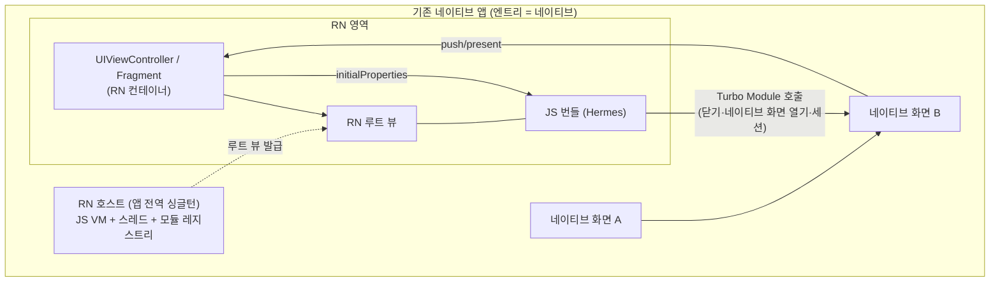

# 그린필드 vs 브라운필드

> [[Greenfield]]는 RN이 앱의 엔트리를 소유하는 신규 앱, [[Brownfield]]는 **기존 네이티브 앱 안에 RN을 라이브러리로 삽입**하는 통합이다. 브라운필드의 난이도는 기술(뷰 하나 띄우기)보다 **경계 설계와 조직 문제**에서 나온다.

## iOS-AOS 대응 개념

| RN 개념 | iOS 대응 | Android 대응 |
|---|---|---|
| [[Greenfield]] 엔트리 | RN 템플릿의 `AppDelegate`가 RN 루트 뷰를 window에 장착 | `ReactActivity`가 런처 액티비티 |
| [[Brownfield]] 삽입 단위 | RN 루트 뷰를 담은 `UIViewController` | RN 루트 뷰를 담은 `Activity`/`Fragment` |
| RN 호스트 | 앱 전역에 하나 유지하는 싱글턴 객체 (JS 런타임 보유) | `ReactHost`를 `Application` 레벨에서 유지 |
| [[Bundle]] 로딩 | 첫 RN 화면 진입 전 워밍업할 리소스 | 동일 |
| 네이티브→RN 데이터 | 루트 뷰 생성 시 `initialProperties` | 동일 (launch options/props) |
| RN→네이티브 복귀 | [[Turbo Module]] 호출로 dismiss/pop 위임 | 동일 |

## 왜 이렇게 설계됐나

RN은 처음부터 "화면 = 네이티브 뷰 계층"으로 설계됐기 때문에 ([[Fabric]]이 최종적으로 `UIView`/`android.view.View`를 만든다), RN 화면 전체를 **하나의 네이티브 뷰**로 취급해 기존 앱에 꽂아 넣는 것이 구조적으로 가능하다. Facebook 앱 자체가 원조 브라운필드였다 — 거대한 네이티브 앱의 일부 화면만 RN이었다.

즉 브라운필드는 변종이 아니라 RN의 태생적 사용 방식 중 하나다. 다만 [[Greenfield]] 템플릿이 앱 초기화·번들 로딩·내비게이션을 전부 대신 해주는 반면, 브라운필드에서는 **그 모든 결정을 내가 직접 내려야 한다**는 차이가 있다.

## 동작 원리

### Greenfield: RN이 엔트리를 소유

`AppDelegate`/`MainActivity`부터 RN 템플릿이 제공한다. 앱 시작 = RN 호스트 초기화 = JS [[Bundle]] 로드. 내비게이션도 JS 세계([[Expo Router]] 또는 React Navigation)가 소유한다. 네이티브 코드는 [[Turbo Module]]/[[Expo Modules API]]로 "기능"을 제공할 뿐, 화면 흐름의 주도권은 JS에 있다. 신규 앱이라면 고민할 것이 거의 없는 기본값이다.

### Brownfield: RN을 라이브러리로 삽입

전체 구조를 먼저 그림으로:



구조는 세 층으로 나뉜다.

**1) 빌드 통합 — RN 의존성을 기존 빌드에 편입**

- iOS: 기존 Podfile에 RN pod들을 추가한다 (RN이 제공하는 Ruby 스크립트 `use_react_native!` 사용). 기존 앱이 CocoaPods를 안 쓰고 있었다면 도입이 선행 과제가 된다. `node_modules` 상대 경로에 의존하므로 JS 패키지 설치가 pod install보다 먼저다.
- Android: `settings.gradle`/`build.gradle`에 RN Gradle 플러그인과 저장소를 추가하고, [[Hermes]]·RN 아티팩트 의존성을 붙인다.
- 양쪽 다 [[Autolinking]]이 JS 패키지의 네이티브 코드를 끌어오도록 구성한다.
- CI 관점: 기존 네이티브 CI에 **Node/yarn 설치 + JS 의존성 설치 + [[Metro]] 번들 생성** 단계가 추가된다. 이게 은근히 큰 변화다 (빌드 머신에 Node 툴체인 상주).

정확한 최신 절차는 공식 문서 [Integration with Existing Apps](https://reactnative.dev/docs/integration-with-existing-apps)를 기준으로 할 것 (버전마다 세부가 바뀐다).

**2) 런타임 통합 — RN 호스트와 화면 장착**

- RN 호스트(JS 런타임 + [[Hermes]] VM을 들고 있는 객체)를 만들고, 거기서 얻은 **RN 루트 뷰**를 `UIViewController`의 view / `Fragment`의 view로 얹는다.
- 핵심 규칙: **RN 호스트는 앱에 하나만 유지한다.** 화면 진입마다 호스트를 새로 만들면 JS VM이 여러 개 뜨고(메모리 수십 MB+), JS 쪽 전역 상태가 화면마다 분리되며, 번들 로딩 비용을 매번 지불한다. `Application`/`AppDelegate` 수준의 싱글턴으로 만들고 루트 뷰만 화면마다 생성하는 것이 정석.
- **번들 로딩 시점 관리**: JS 번들 파싱·실행은 공짜가 아니다. 첫 RN 화면 진입 시점에 로드하면 사용자가 콜드스타트 비용(수백 ms~수 초)을 체감한다. 보통 앱 시작 직후 백그라운드에서 호스트를 **워밍업**해 두고, 진입 시엔 루트 뷰만 붙인다. 트레이드오프: 앱 전체 시작 시간·메모리에 상시 비용 추가 — RN 화면을 안 여는 사용자도 지불한다.

**3) 경계 설계 — 진짜 어려운 부분**

- **네이티브 → RN 데이터 전달**: 루트 뷰 생성 시 `initialProperties`(직렬화 가능한 dict)로 초기 데이터를 넘긴다. 이후 갱신은 이벤트 emit으로.
- **RN → 네이티브**: "뒤로 가기", "네이티브 화면 열기", "로그인 세션 요청" 같은 것은 [[Turbo Module]]을 하나 만들어 위임한다. RN 화면은 자신이 어떤 컨테이너(모달? push?)에 담겼는지 모르게 설계하는 것이 좋다.
- **내비게이션 주도권**: 가장 흔한 실패 지점. "네이티브 내비게이션 스택 안에 RN 화면 여러 장"인지, "RN 진입 후에는 JS 내비게이터가 스택을 소유"인지 **한 가지로 정해야 한다**. 섞으면 뒤로가기 동작, 딥링크, 상태 복원이 전부 애매해진다.
- **인증/세션/로깅/테마의 이중화**: 네이티브 세계와 JS 세계가 각자 토큰 저장소·애널리틱스 SDK·다크모드 상태를 가지면 반드시 어긋난다. 공유 자원은 네이티브가 소유하고 RN은 모듈을 통해 읽어가는 단방향 구조가 안전하다.

### 조직 문제로서의 브라운필드

경험적으로 브라운필드의 최대 리스크는 코드가 아니다:

- **팀 경계**: 네이티브팀과 RN팀이 분리되면 "RN 화면에서 크래시 → 누가 보나?" 문제가 상시 발생한다. 크래시 리포트는 네이티브 스택으로 찍히는데 원인은 JS인 경우가 많아, **양쪽을 다 읽을 수 있는 사람**이 없으면 핑퐁이 난다.
- **빌드 소유권**: RN 의존성 추가로 네이티브 빌드가 깨지면 네이티브팀의 빌드가 인질이 된다. RN 버전 업그레이드 일정은 두 팀의 합의 사항이 된다.
- **성공 조건**: 브라운필드가 잘 굴러가는 조직은 예외 없이 (1) 경계 계약(어떤 모듈, 어떤 이벤트, 어떤 화면 소유권)을 문서화했고 (2) 크로스오버 가능한 개발자를 최소 한 명 확보했다. 시니어 네이티브 개발자가 RN을 배우는 것이 이 지점에서 가장 레버리지가 크다.

또한 브라운필드는 사실상 [[Bare Workflow]]를 강제한다 — 기존 앱의 Xcode/Gradle 프로젝트가 이미 "소스"이므로 [[CNG]]/[[Prebuild]]를 적용할 수 없다. 단, [[Expo Modules API]] 등 개별 Expo 라이브러리는 브라운필드에서도 쓸 수 있다.

## 코드 예시

개념 스케치 (정확한 API는 RN 버전별 공식 문서 확인 — [[New Architecture]] 기준으로 클래스명이 계속 정비되는 중):

```swift
// iOS — 기존 앱의 화면 하나를 RN으로
final class ProfileViewController: UIViewController {
    override func viewDidLoad() {
        super.viewDidLoad()
        // 앱 전역 싱글턴 RN 호스트에서 루트 뷰만 발급
        let rnView = ReactNativeBridge.shared.makeRootView(
            moduleName: "ProfileScreen",           // JS의 AppRegistry 등록명
            initialProperties: ["userId": userId]  // 네이티브 → RN 초기 데이터
        )
        rnView.frame = view.bounds
        rnView.autoresizingMask = [.flexibleWidth, .flexibleHeight]
        view.addSubview(rnView)
    }
}
```

```tsx
// JS — 브라운필드에서는 화면 단위로 등록
import { AppRegistry } from 'react-native';
import { ProfileScreen } from './src/ProfileScreen';

AppRegistry.registerComponent('ProfileScreen', () => ProfileScreen);
```

```kotlin
// Android — Fragment 컨테이너 스케치 (개념 동일)
class ProfileFragment : Fragment() {
    override fun onCreateView(
        inflater: LayoutInflater, container: ViewGroup?, savedInstanceState: Bundle?
    ): View {
        // Application 레벨에서 유지 중인 ReactHost로부터 루트 뷰 발급
        return ReactNativeBridge.makeRootView(
            requireContext(),
            moduleName = "ProfileScreen",
            initialProperties = bundleOf("userId" to userId),
        )
    }
}
```

포인트: [[Greenfield]]는 `registerComponent`가 앱 전체 1개, [[Brownfield]]는 **삽입 지점마다 하나씩** 등록할 수 있다 (하나의 번들에서 여러 엔트리 컴포넌트). 위 `ReactNativeBridge`는 "호스트 싱글턴 + 루트 뷰 팩토리"를 감싼 우리 쪽 파사드라는 가정이다 — 이 파사드를 하나 두면 RN 버전업 시 호스트 API 변화가 앱 전체로 번지지 않는다.

### 경계 계약 체크리스트 (통합 착수 전에 문서로)

- [ ] RN 화면 목록과 각각의 컨테이너 형태 (push / modal / tab)
- [ ] 내비게이션 주도권: 네이티브 스택 소유 vs RN 진입 후 JS 내비게이터 소유
- [ ] 네이티브 → RN 데이터: `initialProperties` 스키마 (버전 필드 포함 권장)
- [ ] RN → 네이티브 API: [[Turbo Module]] 인터페이스 목록 (dismiss, openNativeScreen, getSession...)
- [ ] 공유 자원의 소유자: 인증 토큰, 애널리틱스, 테마/다크모드, 로케일
- [ ] 번들 워밍업 시점과 메모리 예산
- [ ] 크래시/에러 리포팅: JS 에러를 어느 도구로 모으고 누가 트리아지하는가
- [ ] RN 버전 업그레이드의 오너와 주기

## 함정 (Pitfalls)

- **화면마다 RN 호스트를 새로 생성** — 복수 JS VM, 메모리 폭증, 상태 분열. 호스트는 하나, 루트 뷰만 N개.
- **첫 RN 화면에서 번들 로딩 지연을 사용자에게 노출** — 워밍업 전략 없이 배포하면 "이 화면만 이상하게 느리다"는 리뷰로 돌아온다.
- **내비게이션 주도권 미정의** — 네이티브 push 스택과 JS 내비게이터가 섞여 뒤로가기·딥링크가 깨진다. 통합 초기에 계약부터.
- **dev 모드 착각**: 브라운필드에서도 개발 시 [[Metro]] 서버 연결·디버그 메뉴가 필요하다. release 빌드에는 번들을 미리 생성해 리소스로 포함하는 단계(bundle 스크립트)를 기존 빌드 페이즈에 직접 추가해야 하며, 빠뜨리면 "dev에선 되는데 release에서 흰 화면"이 된다.
- **RN 업그레이드를 "라이브러리 버전 업"으로 착각** — RN은 빌드 설정·[[Codegen]]·[[Hermes]]까지 얽힌 플랫폼 업그레이드다. 브라운필드에서는 기존 앱의 최소 OS 버전, Kotlin/Swift 버전, 다른 SDK와의 충돌까지 함께 움직인다.
- **조직 계약 없이 기술 PoC만으로 도입 결정** — PoC는 항상 성공한다. 실패는 6개월 뒤 소유권 분쟁에서 온다.

## 관련 노트

[[Greenfield]] · [[Brownfield]] · [[Bare Workflow]] · [[Turbo Module]] · [[Bundle]] · [[Metro]] · [[Hermes]] · 이전: [[01-Expo-vs-Bare]] · 다음: [[03-의사결정-매트릭스]]
