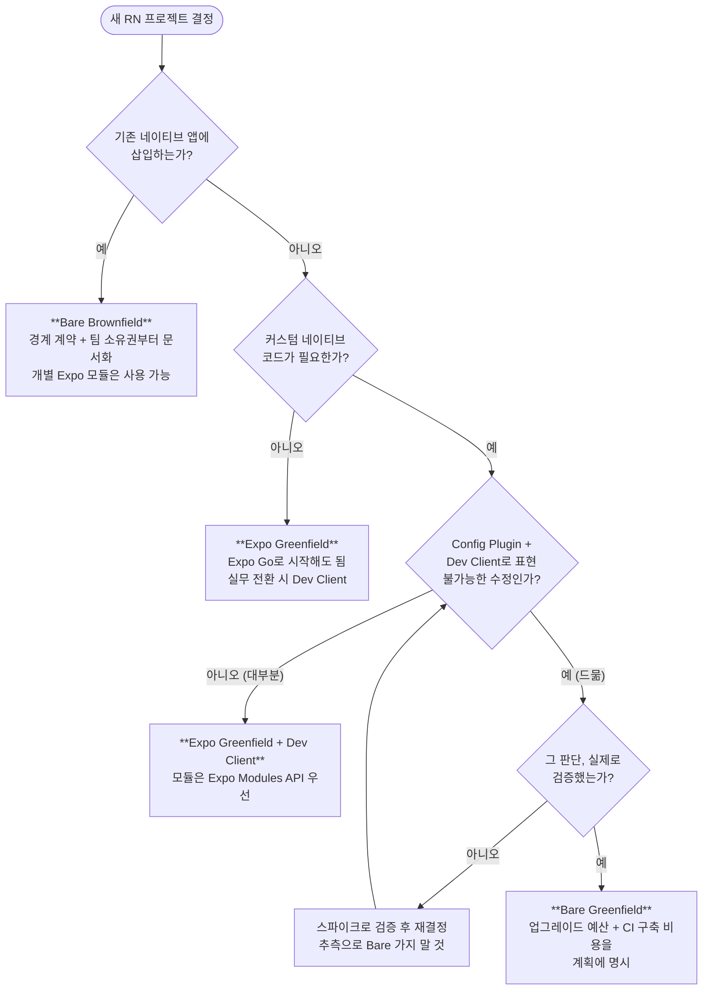

# 의사결정 매트릭스

> Expo/Bare × [[Greenfield]]/[[Brownfield]] 4분면 중 어디에 설 것인가. 결론 요약: **신규 앱이면 Expo Greenfield가 기본값이고, 기존 네이티브 앱 삽입이면 Bare Brownfield 외의 선택지가 사실상 없다.** 진짜 고민은 그 사이의 회색지대다.

## 4분면 정리

| | **[[Greenfield]]** (RN이 엔트리 소유) | **[[Brownfield]]** (기존 앱에 삽입) |
|---|---|---|
| **Expo ([[CNG]])** | ✅ **현재 기본값.** RN 공식 문서 권장 경로. [[EAS]]·[[Expo Router]]·[[OTA Update]] 풀 스택 | ⚠️ 사실상 불가 — 기존 네이티브 프로젝트가 이미 "소스"라 [[Prebuild]]가 성립 안 함. 단 개별 Expo 모듈 사용은 가능 |
| **Bare** | 가능하지만 업그레이드·CI 비용을 스스로 짊어짐. 프레임워크 수준 커스텀이 필요한 드문 경우만 | ✅ 브라운필드의 표준 형태. 기존 Xcode/Gradle 프로젝트에 RN을 의존성으로 편입 |

Logit이 서 있는 곳: **Expo Greenfield** (Expo SDK 57, [[Dev Client]] 기반).

### 사분면별 프로필 한 장씩

**Expo Greenfield** — 신규 앱의 기본값
- 개발 루프: [[Dev Client]] 1회 빌드 후 JS만 [[Metro]]로 갱신
- 네이티브 확장: [[Expo Modules API]] / [[Turbo Module]] + [[Config Plugin]]
- 배포: [[EAS]] Build → Submit → [[OTA Update]]
- 감수할 것: [[CNG]] 규율 (네이티브 직접 수정 금지), Expo 도구 체인 의존

**Bare Greenfield** — 통제와 부채를 맞바꾸는 선택
- 네이티브 프로젝트 완전 통제, 어떤 비표준 구성도 가능
- 감수할 것: RN 업그레이드 수동 머지, CI/배포 파이프라인 자가 구축, [[OTA Update]] 자가 해결
- 정당화 조건: [[Config Plugin]]으로 표현 불가능한 요구가 **검증**됐을 때만

**Bare Brownfield** — 기존 앱 확장의 표준
- 기존 Xcode/Gradle 빌드가 주인, RN은 의존성
- 감수할 것: 경계 계약 설계, 번들 워밍업, 팀 소유권 조정 ([[02-그린필드-vs-브라운필드]] 참고)

**Expo Brownfield** — 성립하지 않는 조합
- [[Prebuild]]가 네이티브 프로젝트를 "생성물"로 전제하는데 브라운필드의 네이티브 프로젝트는 이미 "소스"다
- 단, `expo-*` 개별 패키지와 [[Expo Modules API]] 모듈은 Bare Brownfield에서도 채용 가능 — "Expo 생태계"와 "CNG 워크플로우"를 구분할 것

## 왜 이렇게 설계됐나 — "기본값이 Expo"가 된 이유

과거에는 "일단 Bare로 시작하는 게 안전하다"가 통념이었다. 지금 뒤집힌 이유:

1. **탈출구가 비대칭이다.** Expo → Bare는 언제든 가능하다(`prebuild` 결과물을 커밋하는 순간 Bare다). 반대로 Bare → Expo([[CNG]])는 손으로 쌓은 네이티브 수정을 전부 [[Config Plugin]]으로 역번역해야 하는 큰 공사다. **되돌리기 쉬운 쪽에서 시작하는 것이 옳다.**
2. **[[Dev Client]] + [[Config Plugin]]이 "Expo는 네이티브 못 만짐" 제약을 제거했다.** 커스텀 [[Turbo Module]], 서드파티 네이티브 SDK, 빌드 설정 변경 전부 Expo 안에서 가능하다.
3. RN 공식 문서가 신규 프로젝트에 프레임워크(Expo)를 명시 권장한다. 커뮤니티 라이브러리·문서·채용 풀도 그 방향으로 정렬됐다.

## 시나리오별 권장

### 1. 신규 앱, 1인~소규모 스타트업 → **Expo Greenfield**

- 논거: 네이티브 프로젝트 관리·CI 구축·업그레이드 머지에 쓸 인력이 없다. [[EAS]] Build/Submit이 그 인력을 대체하고, [[OTA Update]]로 심사 없이 JS 수정 배포가 된다.
- 네이티브 개발자라도 마찬가지다. "내가 Xcode를 잘 다루니 Bare"가 아니라, **잘 다루는 사람일수록 반복 노동을 생성물로 밀어내는 가치**를 안다.

### 2. 기존 네이티브 앱에 일부 화면만 RN → **Bare Brownfield**

- 기존 앱의 빌드 시스템이 주인이므로 선택의 여지가 없다. [[02-그린필드-vs-브라운필드]]의 경계 설계 체크리스트를 따를 것.
- 이때도 [[Expo Modules API]]로 만든 모듈이나 개별 `expo-*` 패키지는 가져다 쓸 수 있다 — "Expo를 안 쓴다 = Expo 생태계 포기"가 아니다.

### 3. 네이티브 헤비 앱 (커스텀 카메라 파이프라인, BLE, 백그라운드 오디오, HealthKit...) → **그래도 먼저 Expo + [[Dev Client]]**

흔한 오판: "네이티브 코드가 많을 테니 Bare". 실제로는:

- 커스텀 네이티브 모듈 → [[Expo Modules API]]나 [[Turbo Module]]로 작성, [[Dev Client]]에 포함. Expo 제약 아님.
- Info.plist/entitlements/Gradle 수정 → [[Config Plugin]]으로 선언. Expo 제약 아님.
- 서드파티 네이티브 SDK → [[Autolinking]] + 필요 시 plugin. 대부분 커버.

**진짜 Bare가 필요한 드문 경우**만 남는다:

- 네이티브 프로젝트 구조 자체를 비표준으로 바꿔야 할 때 (멀티 타겟 복잡 구성, App Extension 다수를 정교하게 수동 관리, 사내 전용 빌드 시스템 강제 등 — 일부는 plugin으로 가능하지만 선언 비용이 직접 수정보다 커지는 지점이 있다)
- 조직이 네이티브 프로젝트의 완전한 직접 통제를 정책으로 요구할 때
- 기존 앱 삽입(= 브라운필드, 시나리오 2)

### 4. "일단 프로토타입" → **[[Expo Go]]로 시작하되 수명을 알 것**

[[Expo Go]]는 커스텀 네이티브 모듈이 하나라도 필요해지는 순간 끝나는 환경이다. 그 시점에 [[Dev Client]]로 갈아타는 것은 자연스러운 승격이지 실패가 아니다.

### 5. 네이티브 개발자가 RN을 배우는 개인 프로젝트 → **Expo Greenfield로 시작해서 일부러 안을 들여다보기**

- Bare로 시작하면 익숙한 Xcode/Gradle 세계에 머물게 되어 정작 RN의 사고방식([[CNG]], JS 중심 개발 루프)을 못 배운다.
- 권장 코스: Expo Greenfield로 만들고 → `npx expo prebuild`를 실행해 생성된 `ios/`를 Xcode로 열어 **무엇이 생성됐는지 읽어보고** → 다시 지우는 사이클. 생성물을 읽을 수 있는 것이 네이티브 개발자의 이점이다.

## 잘못된 선택의 비용 (되돌리기 난이도)

| 전환 | 난이도 | 내용 |
|---|---|---|
| Expo → Bare | **낮음** | `npx expo prebuild` 산출물을 커밋하고 CNG를 끊으면 끝. 언제든 가능 |
| Bare → Expo (CNG) | **높음** | 누적된 네이티브 수정을 전수 조사해 `app.config` + [[Config Plugin]]으로 재선언. 수정 이력이 문서화 안 돼 있으면 고고학 |
| Greenfield → Brownfield | 중간 | 엔트리를 네이티브로 되돌리고 RN을 화면 단위로 재편 — 내비게이션 재설계 동반 |
| Brownfield → Greenfield | 중간~높음 | 남은 네이티브 화면 전부를 RN으로 이관해야 성립. 점진적 이관 자체가 브라운필드 운영이므로 긴 여정 |

핵심: **비가역성이 큰 결정(Bare 선택, 브라운필드 도입)일수록 명시적 근거를 문서로 남겨야 한다.** "익숙해서"는 근거가 아니다.

### 네이티브 헤비 요구별 커버 여부 빠른 참조

"이 기능 때문에 Bare 필요한가?"에 대한 즉답 표. 전부 **Expo + [[Dev Client]] 기준**:

| 요구 | Expo에서 가능? | 방법 |
|---|---|---|
| 커스텀 카메라 파이프라인 | ✅ | 커뮤니티 모듈(vision-camera 등) 또는 자체 [[Expo Modules API]] 모듈 |
| BLE | ✅ | 커뮤니티 모듈 + [[Config Plugin]]으로 권한 선언 |
| HealthKit / Google Fit | ✅ | 네이티브 모듈 + entitlements를 plugin으로 |
| 백그라운드 오디오/위치 | ✅ | `UIBackgroundModes` 등을 plugin으로 선언 |
| 푸시 알림 (커스텀 서비스 포함) | ✅ | expo-notifications 또는 자체 모듈 |
| App Extension (위젯, 공유) | ⚠️ | plugin으로 타겟 추가 가능하나 선언 비용이 큼 — 복잡도에 따라 Bare 고려 지점 |
| 기존 네이티브 앱에 삽입 | ❌ | Bare Brownfield |
| 비표준 빌드 시스템 강제 (사내 정책) | ❌ | Bare |

⚠️ 행이 바로 플로차트의 Q3-Q4 구간이다. 여기서만 스파이크가 필요하다.

## 결정 플로차트



## 결정을 기록하는 법 — 미니 ADR 템플릿

플로차트의 출구가 어디든, 아래 5줄을 리포에 남겨두면 1년 뒤의 자신(과 새 팀원)이 "왜 이 구조지?"에서 시작하지 않아도 된다:

```markdown
# ADR-001: RN 프로젝트 유형 선택

- 결정: Expo Greenfield (SDK 57, Dev Client)
- 검토한 대안: Bare Greenfield
- 결정 근거: 1인 개발, CI 구축 인력 없음, 네이티브 요구는
  Config Plugin으로 전부 표현 가능함을 스파이크로 확인 (링크)
- 재검토 트리거: App Extension 3개 이상 필요해지는 시점,
  또는 prebuild로 표현 불가능한 네이티브 수정이 발생하는 시점
- 탈출 비용: prebuild 산출물 커밋으로 Bare 전환 가능 (낮음)
```

"재검토 트리거"가 핵심이다. 유형 선택은 한 번의 결정이 아니라 **조건이 바뀌면 갱신되는 가설**이고, 트리거를 미리 적어두면 감정이 아니라 조건으로 재논의할 수 있다.

## 함정 (Pitfalls)

- **"네이티브 개발자가 있으니 Bare가 싸다"** — 초기 속도와 총소유비용(TCO)을 혼동한 것. Bare의 비용은 업그레이드 시점에 후불로 온다.
- **"Expo는 나중에 한계가 온다"를 검증 없이 믿기** — 2019년 이전의 eject 시대 정보다. 한계가 의심되면 해당 기능 하나로 스파이크를 떠서 확인하라. 플로차트의 Q4가 그 지점이다.
- **4분면을 고정값으로 착각** — Expo Greenfield로 시작해 특정 시점에 `ios/`를 커밋하고 Bare로 전환하는 것은 정상적인 진화 경로다. 반대 방향만 비싸다.
- **브라운필드에서 "임시로 화면 몇 개만"이라며 계약 없이 시작** — 임시는 없다. 6개월 뒤 그 구조가 표준이 된다.
- **팀 역량 축을 빼고 기술 축만 비교** — RN을 아는 사람이 0명인 네이티브 팀이라면, 어떤 사분면이든 첫 프로젝트는 학습 곡선 비용이 지배적이다. 작게 시작해서 [[Dev Client]] 루프에 익숙해지는 게 우선.

## 관련 노트

[[01-Expo-vs-Bare]] · [[02-그린필드-vs-브라운필드]] · [[CNG]] · [[Config Plugin]] · [[Dev Client]] · [[EAS]] · [[Expo Modules API]] · 다음 챕터: [[01-Turbo-Native-Module-작성|Turbo Native Module 작성]]
