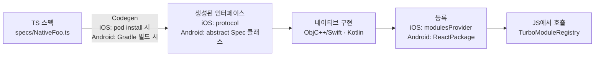

# Turbo Native Module 작성

> [!abstract] 한 줄 요약
> JS에서 부를 수 있는 네이티브 API를 만드는 정공법: **TS로 스펙을 쓰면 [[Codegen]]이 네이티브 인터페이스를 생성하고, 그 인터페이스를 Swift/Objective-C++·Kotlin으로 구현해 등록한다.** 네이티브 개발자가 RN 팀에 가장 빨리 기여할 수 있는 영역이다 — 구현부는 여러분이 이미 아는 세계다.

## 🔁 iOS-AOS 대응 개념

| RN 개념 | iOS 대응 | Android 대응 |
|---|---|---|
| TS 스펙 파일 | `.h` 헤더 / protocol 선언의 역할 | interface 선언의 역할 |
| [[Codegen]] 산출물 | 준수해야 할 Objective-C protocol | 상속해야 할 abstract class (Spec) |
| 모듈 구현체 | protocol을 채택한 클래스 | Spec을 상속한 Kotlin 클래스 |
| 모듈 등록 | (개념상) DI 컨테이너 등록 | `ReactPackage`에 모듈 제공 |
| [[JSI]] 호출 | 프로세스 내 직접 함수 호출 (IPC 아님) | 동일 — AIDL/Binder 같은 직렬화 경계 없음 |
| 이벤트 emit | `NotificationCenter`/delegate 콜백의 역할 | listener/callback의 역할 |

## 🧭 왜 이렇게 설계됐나

구세대 Native Module([[Bridge]] 시대)은 JS↔네이티브 사이에 **타입 계약이 없었다**. JS가 문자열 이름으로 메서드를 부르고 인자를 JSON 직렬화해 큐로 넘겼기 때문에, 타입 불일치는 런타임에야 터졌고 모든 호출이 비동기+직렬화 비용을 냈다.

[[Turbo Module]]은 이 문제를 두 가지로 해결한다:

1. **[[Codegen]] = 컴파일 타임 계약**: TS 스펙에서 네이티브 인터페이스(iOS protocol / Android abstract class)를 생성한다. 스펙과 구현이 어긋나면 **네이티브 빌드가 실패**한다. Swift에서 protocol conformance가 깨지면 컴파일이 안 되는 것과 같은 안전망이 JS↔네이티브 경계에 생긴 것.
2. **[[JSI]] = 직렬화 없는 직접 호출**: JS 함수 호출이 C++ 경유로 네이티브 객체 메서드를 직접 부른다. 동기 메서드도 가능해졌고, lazy loading(첫 호출 시점에 모듈 초기화)으로 앱 시작 비용도 줄었다.

[[New Architecture]]([[Bridgeless]])에서는 이것이 유일한 네이티브 모듈 경로다.

## ⚙️ 동작 원리 — 전체 흐름



1. **TS 스펙 작성**: `TurboModuleRegistry`용 스펙 파일. 이 파일이 계약의 원본이다.
2. **[[Codegen]] 실행**: iOS는 `pod install` 중에, Android는 Gradle 빌드 중에 자동으로 돈다. 스펙을 파싱해 네이티브 인터페이스 코드를 생성.
3. **네이티브 구현**: 생성된 protocol/abstract class를 구현한다.
4. **등록**: RN 런타임이 "이 이름의 모듈은 이 클래스"를 찾을 수 있게 연결한다.
5. **JS 호출**: `TurboModuleRegistry.getEnforcing<Spec>()`으로 얻은 객체의 메서드를 부르면 [[JSI]]를 타고 네이티브 구현이 실행된다.

## 💻 코드 예시 — 최소 모듈 (RN 0.76+)

간단한 키-값 저장 모듈. 동기 1개 + 비동기 1개 + 이벤트 1개.

### 1) TS 스펙 — `specs/NativeSimpleStorage.ts`

```ts
import type { TurboModule } from 'react-native';
import { TurboModuleRegistry } from 'react-native';

export interface Spec extends TurboModule {
  // 동기 메서드 — JSI라서 가능. UI 스레드 블로킹 주의해서 짧은 것만
  getItem(key: string): string | null;

  // 비동기 메서드 — Promise 반환
  setItem(key: string, value: string): Promise<void>;
}

export default TurboModuleRegistry.getEnforcing<Spec>('NativeSimpleStorage');
```

### 2) codegenConfig — `package.json`

```json
{
  "codegenConfig": {
    "name": "AppSpecs",
    "type": "modules",
    "jsSrcsDir": "specs",
    "android": { "javaPackageName": "com.logit.specs" }
  }
}
```

### 3) iOS 구현 스케치

[[Codegen]]이 `pod install` 시 `NativeSimpleStorageSpec` protocol을 생성한다. 공식 가이드 예시는 Objective-C(++) 기준:

```objc
// RCTNativeSimpleStorage.h
#import <AppSpecs/AppSpecs.h>
@interface RCTNativeSimpleStorage : NSObject <NativeSimpleStorageSpec>
@end
```

```objc
// RCTNativeSimpleStorage.mm — 안은 그냥 익숙한 코드다
- (NSString * _Nullable)getItem:(NSString *)key {
  return [NSUserDefaults.standardUserDefaults stringForKey:key];
}

- (void)setItem:(NSString *)key value:(NSString *)value
        resolve:(RCTPromiseResolveBlock)resolve reject:(RCTPromiseRejectBlock)reject {
  [NSUserDefaults.standardUserDefaults setObject:value forKey:key];
  resolve(nil);
}
```

앱 프로젝트에서의 등록은 `package.json`의 codegenConfig에 매핑을 선언하는 방식이다:

```json
"ios": { "modulesProvider": { "NativeSimpleStorage": "RCTNativeSimpleStorage" } }
```

Swift로 쓰고 싶다면: Turbo Module 인터페이스는 C++와 맞닿아 있어 Objective-C(++) 인터롭 레이어가 필요하다. **Swift-first로 가려면 [[Expo Modules API]]가 훨씬 매끄럽다** ([[03-Expo-Modules-API]] 참고). 세부 보일러플레이트는 [공식 Native Modules 가이드](https://reactnative.dev/docs/turbo-native-modules-introduction) 기준으로.

### 4) Android 구현 스케치

Gradle 빌드가 abstract class `NativeSimpleStorageSpec`을 생성한다:

```kotlin
class NativeSimpleStorageModule(reactContext: ReactApplicationContext) :
    NativeSimpleStorageSpec(reactContext) {

  override fun getName() = "NativeSimpleStorage"

  override fun getItem(key: String): String? =
      prefs().getString(key, null)

  override fun setItem(key: String, value: String, promise: Promise) {
    prefs().edit().putString(key, value).apply()
    promise.resolve(null)
  }

  private fun prefs() =
      reactApplicationContext.getSharedPreferences("storage", Context.MODE_PRIVATE)
}
```

등록은 `BaseReactPackage`를 만들어 `MainApplication`의 패키지 목록에 추가한다 (보일러플레이트는 공식 문서 참고).

### 5) JS에서 사용

```ts
import SimpleStorage from './specs/NativeSimpleStorage';

const cached = SimpleStorage.getItem('lastWorkout');   // 동기
await SimpleStorage.setItem('lastWorkout', 'running'); // 비동기
```

## 이벤트 emit — 네이티브 → JS

RN 0.76+에서는 스펙에 `EventEmitter` 타입을 선언하면 [[Codegen]]이 emit 헬퍼를 생성한다:

```ts
import type { EventEmitter } from 'react-native/Libraries/Types/CodegenTypes';

export interface Spec extends TurboModule {
  readonly onValueChanged: EventEmitter<string>;
}
```

네이티브에서는 생성된 `emitOnValueChanged(...)` 계열 메서드를 호출하면 된다 — delegate 콜백 대신 "구독 가능한 스트림을 노출한다"는 감각. JS에서는 `SimpleStorage.onValueChanged((v) => ...)`로 구독하고 반환된 subscription을 해제한다. 정확한 시그니처는 버전별로 다듬어지는 중이니 [공식 문서의 이벤트 섹션](https://reactnative.dev/docs/turbo-native-modules-introduction)을 기준으로 할 것.

## ⚠️ 함정 (Pitfalls)

- **스펙 파일 네이밍 규칙이 강제다**: 모듈 스펙 파일명은 `Native`로 시작해야 한다 (`NativeSimpleStorage.ts`). [[Codegen]]이 이 접두사로 스펙 파일을 찾는다. 규칙을 어기면 에러가 아니라 **조용히 아무것도 생성되지 않는다.**
- **스펙 변경 후 codegen 재실행을 잊는 것**: TS 스펙을 고쳐도 JS만 다시 번들되지 네이티브 인터페이스는 그대로다. iOS는 `pod install`을 다시 돌려야 하고, Android는 Gradle 빌드가 다시 생성한다. "스펙 바꿨는데 반영이 안 돼요"의 90%가 이것. [[Metro]] 리로드로는 절대 해결되지 않는다.
- **스펙에 쓸 수 있는 타입이 제한적이다**: [[Codegen]]이 이해하는 타입(기본형, 배열, object 리터럴 타입, Promise 등)만 가능. 임의의 TS 유니온·제네릭은 안 된다. 타입 에러 메시지가 불친절하므로 스펙은 단순하게 유지.
- **동기 메서드 남용**: 동기 호출은 JS 스레드를 붙잡는다. 그 안에서 디스크 I/O나 락을 잡으면 JS 스레드 전체([[Fabric]] 커밋 포함)가 멈춘다. 동기는 "메모리에 이미 있는 값 읽기" 수준으로 제한.
- **스레딩 가정**: 모듈 메서드는 메인 스레드에서 불린다는 보장이 없다. UIKit/View 조작이 필요하면 명시적으로 메인 스레드로 hop 해야 한다 — 네이티브 개발자에겐 익숙한 규칙이지만, "RN이 알아서 해주겠지"라고 가정하기 쉽다.
- **앱 로컬 모듈 vs 라이브러리 모듈의 등록 방식 차이**: 위 예시는 앱 안에 직접 만드는 경우. npm 라이브러리로 배포하려면 [[Autolinking]] 규약(podspec, `react-native.config.js` 등)을 갖춰야 한다 — [[04-Autolinking과-라이브러리-평가]] 참고.

## 🔗 관련 노트

[[Turbo Module]] · [[Codegen]] · [[JSI]] · [[New Architecture]] · [[Bridgeless]] · [[Bridge]] · 다음: [[02-Fabric-Native-Component]] · 더 쉬운 대안: [[03-Expo-Modules-API]]
