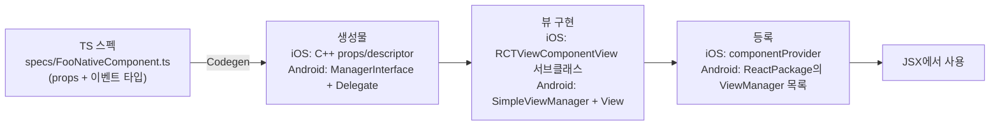

# Fabric Native Component

> 커스텀 **네이티브 뷰**(UIView / android.view.View)를 RN의 JSX 트리 안에서 `<MyView prop={...} />`처럼 쓰게 만드는 방법. [[Turbo Module]]이 "기능"의 경계라면, Fabric Native Component는 "화면"의 경계다. 흐름은 동일하다: TS 스펙 → [[Codegen]] → 네이티브 뷰 구현 → 마운트.

## iOS-AOS 대응 개념

| RN 개념 | iOS 대응 | Android 대응 |
|---|---|---|
| Native Component | `UIView` 서브클래스 | `View` 서브클래스 |
| 컴포넌트 뷰 (iOS) | `RCTViewComponentView` 상속 — [[Fabric]]이 관리하는 컨테이너 | — |
| ViewManager (Android) | — | `SimpleViewManager<V>` — 뷰 생성·props 반영 담당 |
| props 업데이트 | `updateProps` 콜백에서 뷰 속성 반영 | `@ReactProp` 스타일 세터 (codegen 인터페이스 경유) |
| 이벤트 콜백 | target-action/delegate → JS 함수 | listener → JS 함수 |
| 마운트/언마운트 | [[Fabric]]이 `addSubview`/재사용 풀 관리 | [[Fabric]]이 `addView`/recycle 관리 |

## 왜 이렇게 설계됐나

RN의 기본 컴포넌트(`<View>`, `<Text>`, `<ScrollView>`...)도 사실 전부 같은 메커니즘으로 노출된 네이티브 뷰다. 즉 Fabric Native Component는 특수 기능이 아니라 **RN 코어가 자기 자신을 만들 때 쓰는 바로 그 확장점**을 열어둔 것이다.

[[New Architecture]] 이전의 ViewManager 방식은 [[Bridge]]를 거치며 props가 JSON으로 직렬화됐고, 레이아웃-마운트 타이밍 제어가 어려웠다. [[Fabric]] 기반에서는:

- props가 [[Codegen]]으로 생성된 **C++ 타입**으로 전달된다 — 타입 안전 + 직렬화 비용 절감.
- [[Shadow Tree]]의 커밋과 마운트가 렌더러(C++) 수준에서 관리되어, 뷰 재사용(recycling)과 동시성 렌더링이 가능해졌다.

## 언제 필요한가

- **지도**: MapKit/Google Maps 뷰를 RN 화면에 임베드
- **비디오 플레이어**: `AVPlayerLayer`/ExoPlayer 기반 커스텀 플레이어
- **기존 사내 네이티브 UI 재사용**: 이미 잘 만들어진 차트 뷰, 결제 위젯, 카메라 프리뷰를 RN 화면에서 그대로 쓰고 싶을 때 — [[Brownfield]] 팀의 단골 요구
- **성능 임계 UI**: 60fps 제스처·드로잉이 필요해 JS 왕복을 화면 밖으로 빼고 싶을 때

반대로 **버튼·카드·리스트 같은 일반 UI를 네이티브로 만들 이유는 없다**. RN의 존재 이유가 그걸 JS로 만드는 것이다. Native Component는 "플랫폼 뷰 그 자체가 자산일 때"만 꺼내는 카드다.

그리고 만들기 전에 확인: 지도·비디오·웹뷰·카메라 같은 단골 케이스는 이미 성숙한 커뮤니티 라이브러리가 존재한다 ([[04-Autolinking과-라이브러리-평가]]의 평가 루틴으로 검증 후 채택). 직접 작성이 정당화되는 것은 **사내 자산 재사용**이거나 기존 라이브러리가 요구를 못 채울 때다.

## 동작 원리 — 전체 흐름



렌더 파이프라인 안에서의 위치: React가 엘리먼트 트리를 만들고 → [[Fabric]]이 [[Shadow Tree]]에서 Yoga 레이아웃을 계산하고 → 마운트 단계에서 **내가 만든 뷰 클래스의 인스턴스**를 생성해 계산된 frame으로 붙인다. 내 뷰는 자기 크기를 스스로 정하지 않고 Fabric이 주는 frame을 받는다는 것이 UIKit 감각과의 결정적 차이다 (intrinsic size가 필요하면 별도 처리 필요).

### props 전달

스펙의 props 인터페이스가 [[Codegen]]을 거쳐 iOS에서는 C++ props 구조체로, Android에서는 setter 인터페이스로 변한다. props가 바뀔 때마다:

- iOS: `updateProps(props, oldProps)`가 불리고, 새/old를 비교해 바뀐 것만 뷰에 반영한다.
- Android: 생성된 `ManagerInterface`의 세터(`setUrl(view, value)` 등)가 불린다.

### 이벤트 콜백 (네이티브 → JS)

스펙에 `DirectEventHandler<PayloadType>` 타입의 prop을 선언하면, [[Codegen]]이 이벤트 emitter를 생성한다. 네이티브 뷰에서 사용자 인터랙션이 일어나면 emitter를 호출하고, JS에서는 `<Foo onSomething={(e) => ...} />` 콜백으로 받는다. delegate 패턴을 "콜백 prop"으로 뒤집은 것.

## 코드 예시 — 구조 이해용 스케치 (RN 0.76+)

전체 보일러플레이트는 [공식 Fabric Native Components 가이드](https://reactnative.dev/docs/fabric-native-components-introduction)에 있다. 여기서는 뼈대만.

### 1) TS 스펙 — `specs/LogitChartNativeComponent.ts`

```ts
import type { HostComponent, ViewProps } from 'react-native';
import type { DirectEventHandler } from 'react-native/Libraries/Types/CodegenTypes';
import codegenNativeComponent from 'react-native/Libraries/Utilities/codegenNativeComponent';

type PointPressedEvent = { index: number };

export interface NativeProps extends ViewProps {
  // props: codegen이 이해하는 타입만
  dataPoints: ReadonlyArray<number>;
  lineColor?: string;
  // 이벤트: 네이티브 → JS 콜백
  onPointPressed?: DirectEventHandler<PointPressedEvent>;
}

export default codegenNativeComponent<NativeProps>(
  'LogitChart',
) as HostComponent<NativeProps>;
```

`package.json`의 codegenConfig는 [[Turbo Module]]과 공유하되 `"type": "all"` 또는 components 포함으로 설정.

### 2) iOS 스케치

```objc
// RCTLogitChart.mm — RCTViewComponentView 상속
- (void)updateProps:(Props::Shared const &)props
           oldProps:(Props::Shared const &)oldProps {
  auto const &newProps = *std::static_pointer_cast<LogitChartProps const>(props);
  // 바뀐 props만 내부 UIView(차트)에 반영
  _chartView.lineColor = RCTUIColorFromSharedColor(newProps.lineColor);
  [super updateProps:props oldProps:oldProps];
}
```

등록: `package.json` codegenConfig의 `ios.componentProvider`에 `"LogitChart": "RCTLogitChart"` 매핑. 내부에 기존 Swift 차트 뷰를 subview로 안고 있으면 **기존 사내 UI 재사용**이 그대로 성립한다.

### 3) Android 스케치

```kotlin
// codegen이 생성한 인터페이스 + delegate를 구현하는 ViewManager
class LogitChartManager : SimpleViewManager<LogitChartView>(),
    LogitChartManagerInterface<LogitChartView> {

  private val delegate = LogitChartManagerDelegate(this)
  override fun getDelegate() = delegate
  override fun getName() = "LogitChart"

  override fun createViewInstance(context: ThemedReactContext) = LogitChartView(context)

  override fun setDataPoints(view: LogitChartView, value: ReadableArray?) {
    view.render(value?.toArrayList())
  }
}
```

등록은 `ReactPackage.createViewManagers()` 목록에 추가. 이벤트는 codegen이 만든 EventEmitter를 통해 dispatch.

### 4) JS에서 사용

```tsx
import LogitChart from './specs/LogitChartNativeComponent';

<LogitChart
  style={{ height: 240 }}
  dataPoints={weeklyDistances}
  lineColor="#34C759"
  onPointPressed={(e) => showDetail(e.nativeEvent.index)}
/>;
```

이 시점부터 이 네이티브 뷰는 여느 RN 컴포넌트처럼 flexbox 레이아웃·조건부 렌더·리스트 아이템으로 쓸 수 있다.

## 함정 (Pitfalls)

- **파일 네이밍 규칙**: 컴포넌트 스펙 파일은 `<이름>NativeComponent.ts`로 끝나야 [[Codegen]]이 인식한다. [[Turbo Module]]의 `Native` 접두사 규칙과 다르다 — 둘을 섞어 기억하면 조용한 실패.
- **스펙 수정 후 재빌드 누락**: props 하나 추가해도 네이티브 재빌드([[Codegen]] 재실행)가 필요하다. JS만 리로드하면 "prop이 전달 안 됨"으로 보인다.
- **뷰 재사용(recycling)을 잊는 것**: [[Fabric]]은 성능을 위해 컴포넌트 뷰 인스턴스를 재사용할 수 있다 (iOS `prepareForRecycle`). `UITableViewCell.prepareForReuse`와 동일한 규율 — 상태를 리셋하지 않으면 이전 화면의 잔상이 다른 자리에서 나타난다. 네이티브 개발자라면 오히려 익숙한 함정.
- **레이아웃 주도권 착각**: 크기는 Yoga가 정한다. 네이티브 뷰가 `intrinsicContentSize`로 자기 크기를 주장해도 반영되지 않는다. 콘텐츠 기반 크기가 필요하면 measure 로직을 [[Shadow Tree]] 쪽에 제공하는 고급 경로(custom ShadowNode/state)가 필요하다 — 이 지점부터 난이도가 급상승하니, 가능하면 JS에서 크기를 지정하는 설계로 우회하라.
- **이벤트 남발**: 스크롤·드래그마다 이벤트를 emit하면 JS 스레드가 이벤트 처리로 포화된다. 연속 제스처는 네이티브에서 처리하고 결과만 (throttle해서) 올리는 설계가 기본.
- **"컴포넌트로 만들 것 vs 모듈로 만들 것" 혼동**: 화면에 그려지는 것 = Component, 화면 없는 기능 = [[Turbo Module]]. 카메라처럼 둘 다인 경우(프리뷰 뷰 + 촬영 API)는 Component와 Module을 한 라이브러리에서 함께 노출한다.
- **명령형 API가 필요할 때 이벤트/props로 억지 우회**: `player.seek(30)` 같은 명령은 props로 모델링하면 어색해진다 (`seekTo={30}` 후 리셋?). 이런 경우 ref 기반 네이티브 커맨드(codegen의 command 지원)나, 차라리 [[Expo Modules API]]의 View + AsyncFunction 조합이 자연스럽다. props는 상태, 커맨드는 동작 — 구분해서 설계하라.

## 관련 노트

[[Fabric]] · [[Codegen]] · [[Shadow Tree]] · [[New Architecture]] · [[Turbo Module]] · 이전: [[01-Turbo-Native-Module-작성]] · 더 쉬운 대안: [[03-Expo-Modules-API]] (View DSL)
