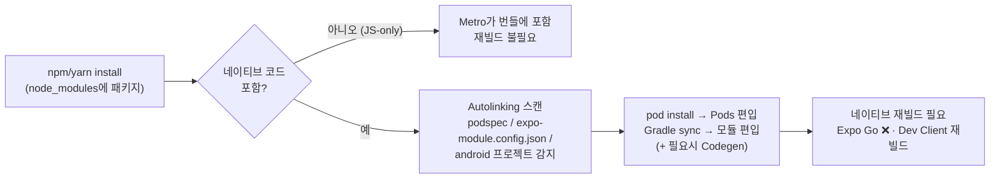

# Autolinking과 라이브러리 평가

> `npm install` 한 패키지의 **네이티브 코드가 어떻게 내 Xcode/Gradle 빌드에 자동으로 편입되는가**([[Autolinking]]) — 그리고 그 자동화 때문에 더 중요해진 질문: **이 라이브러리, 내 앱에 들여도 되는가**를 평가하는 법. 네이티브 개발자의 최종 병기는 "소스를 직접 읽고 판단할 수 있다"는 것이다.

## iOS-AOS 대응 개념

| RN 개념 | iOS 대응 | Android 대응 |
|---|---|---|
| npm 패키지의 네이티브 코드 | 서드파티 pod | 서드파티 Gradle 모듈/AAR |
| [[Autolinking]] | Podfile에 `pod '...'`를 손으로 쓰는 일의 자동화 | `settings.gradle` `include` + 의존성 선언의 자동화 |
| podspec / `expo-module.config.json` | podspec 그 자체 | Gradle 모듈 인식용 매니페스트 |
| JS-only 패키지 | (네이티브 대응물 없음 — 리소스만 있는 SPM 패키지 느낌) | 동일 |
| reactnative.directory | CocoaPods 검색 + 품질 지표 대시보드 | Android Arsenal의 역할 + 지표 |

## 왜 이렇게 설계됐나

RN 초기에는 네이티브 코드가 있는 라이브러리를 설치하면 **수동 링킹**을 했다: Xcode 프로젝트에 파일 끌어다 넣고, Header Search Path 고치고, Gradle에 `include` 추가하고, `MainApplication`의 패키지 목록에 한 줄 추가하고... README마다 "Manual Installation" 섹션이 한 페이지씩 있었고, 오타 하나로 빌드가 깨졌다.

RN 0.60(2019)에서 [[Autolinking]]이 도입되며 이 절차가 사라졌다. 설계 아이디어는 단순하다: **패키지 스스로 "나 네이티브 코드 있어요"를 규약된 형태로 선언하게 하고, 빌드 시스템이 `node_modules`를 스캔해 자동으로 연결한다.** npm이라는 JS 세계의 의존성 그래프와 CocoaPods/Gradle이라는 네이티브 세계의 의존성 그래프를 잇는 다리다.

## 동작 원리

### iOS — `pod install`이 하는 일

RN 템플릿의 Podfile에는 autolinking 훅이 들어 있다 (커뮤니티 CLI 기준 `use_native_modules!`, Expo 프로젝트는 Expo autolinking이 이 역할을 흡수). `pod install`을 실행하면:

1. 훅이 Node 스크립트를 실행해 `node_modules`를 스캔한다.
2. **podspec 파일을 가진 패키지**들이 "네이티브 코드 있는 RN 라이브러리"로 인식된다 (패키지가 `react-native.config.js`로 동작을 재정의할 수도 있다).
3. 각 패키지의 podspec이 로컬 경로 pod로 Podfile에 주입된 것과 동일한 효과로 설치된다.
4. 결과: Pods 프로젝트에 라이브러리들의 네이티브 타겟이 생기고, [[New Architecture]] 라이브러리라면 이 시점에 [[Codegen]]도 함께 돌아 생성 코드가 포함된다.

즉 `Podfile.lock`을 열어 보면 설치된 RN 라이브러리의 네이티브 부분이 전부 pod으로 보인다 — 익숙한 도구로 전체 그림을 감사할 수 있다는 뜻이다.

### Android — Gradle sync가 하는 일

`settings.gradle`의 RN 플러그인이 동일한 스캔을 수행한다: `node_modules`에서 Android 프로젝트(`android/build.gradle`)를 가진 RN 패키지를 찾아 Gradle 빌드에 포함시키고, 앱 모듈에 의존성으로 연결하며, `MainApplication`에 수동으로 추가하던 `ReactPackage` 목록도 생성 코드(`PackageList`)로 자동 구성한다.

### Expo Autolinking

Expo 프로젝트([[CNG]])는 자체 구현인 **Expo Autolinking**(`expo-modules-autolinking`)을 쓴다. 차이점:

- `expo-module.config.json`을 가진 [[Expo Modules API]] 패키지와, 일반 RN 라이브러리(podspec 기반)를 **모두** 링크한다. 즉 Expo 프로젝트에서 커뮤니티 RN 라이브러리도 그냥 동작한다.
- [[Prebuild]] 산출물의 Podfile/settings.gradle에 이미 배선되어 있으므로 사용자는 존재를 의식할 일이 거의 없다.
- 문제 진단 시 유용한 명령: `npx expo-modules-autolinking verify` / `npx expo config --type introspect`로 무엇이 링크되는지 확인 가능.

### 전체 흐름 한 장



이 분기가 실무 감각의 핵심이다: **JS-only 패키지는 설치 즉시 쓰지만, 네이티브 포함 패키지는 `pod install` + 재빌드가 필요하고 [[Expo Go]]에서는 아예 못 쓴다** (해당 모듈이 Expo Go에 미리 구워져 있지 않은 한).

### 세 가지 autolinking 구현 정리

역사적 이유로 구현이 여럿이라 이름이 헷갈린다. 실무에서 만나는 것은:

| 구현 | 프로젝트 | 스캔 대상 | 훅 위치 |
|---|---|---|---|
| 커뮤니티 CLI autolinking | Bare RN (커뮤니티 템플릿) | podspec / android 프로젝트 | Podfile `use_native_modules!`, settings.gradle 플러그인 |
| **Expo Autolinking** | Expo ([[CNG]]) — Logit의 경우 | `expo-module.config.json` **+ 일반 RN 라이브러리** | [[Prebuild]] 산출물에 내장 |
| 수동 링킹 | RN 0.60 이전 / 특수 케이스 | — | README의 수동 절차 |

혼동 포인트 하나만 기억하면 된다: **Expo Autolinking이 상위 호환**이다. Expo 프로젝트에서 "이 라이브러리는 Expo용이 아닌데 되나요?"의 답은 대부분 "된다"이고, 안 되는 이유는 링킹이 아니라 [[Config Plugin]] 부재(네이티브 설정 필요 시)나 [[New Architecture]] 미대응이다.

### 무엇이 링크됐는지 확인하는 법

"설치했는데 왜 안 돼요"를 감으로 풀지 말고 관찰하라. 네이티브 개발자에게 익숙한 감사 지점들:

```bash
# Expo 프로젝트: 링크 대상 목록 확인
npx expo-modules-autolinking search      # 발견된 Expo 모듈
npx expo-modules-autolinking verify      # 링크 상태 검증

# iOS: 결과물은 결국 Pods다
cat ios/Podfile.lock | grep -A2 "라이브러리명"

# Android: 포함된 프로젝트 확인
cd android && ./gradlew :app:dependencies --configuration implementation
```

- **iOS 최종 확인**: Xcode에서 Pods 프로젝트를 열면 링크된 모든 RN 라이브러리가 타겟으로 보인다. 링커 에러가 나면 여기서 해당 타겟의 존재부터 확인.
- **런타임 확인**: 앱 실행 후 해당 모듈이 null이면 "링크 안 됨(재빌드 필요)"이고, 예외 메시지가 구체적이면 "링크는 됐고 사용법/설정 문제"다. 이 구분이 디버깅 시간을 크게 줄인다.

## 라이브러리 평가 체크리스트

자동으로 링크된다는 것은 **자동으로 내 앱의 크래시 표면이 된다**는 뜻이기도 하다. npm의 라이브러리 품질 분산은 CocoaPods/Maven Central보다 훨씬 크다. 들이기 전에:

### 1. 네이티브 코드 포함 여부 — 비용 등급 판정

- 리포에 `ios/`, `android/` 디렉토리나 `.podspec`이 있으면 네이티브 포함.
- 네이티브 포함 = 재빌드 필요, [[Expo Go]] 불가, 앱 크기 증가, **RN/OS 버전 업그레이드 때 같이 깨질 수 있는 표면**. JS-only 대비 한 단계 무거운 결정으로 취급하라.
- 같은 문제를 푸는 JS-only 대안이 있으면 우선 검토 (예: 애니메이션에 네이티브 라이브러리 전에 JS 구현 확인).

### 2. [[New Architecture]] 지원 — 2026년 기준 사실상 필수

확인 방법:

- [reactnative.directory](https://reactnative.directory)에서 검색 → "New Architecture" 뱃지 확인. 이 사이트가 1차 관문이다 (플랫폼 지원, 유지보수 상태, 인기도를 한 화면에 보여준다).
- 리포에서 직접 확인: `package.json`에 `codegenConfig`가 있으면 [[Turbo Module]]/[[Fabric]] 스펙 기반, `expo-module.config.json`이 있으면 [[Expo Modules API]] 기반 — 둘 다 New Architecture 대응 신호.
- 반대 신호: `NativeModules.X` 직접 접근만 있는 오래된 코드, "interop layer에서만 동작" 이슈 스레드. RN의 레거시 아키텍처는 이미 동결(frozen) 상태라, 미지원 라이브러리는 시한부다.

### 3. 유지보수 상태 — 다운로드 수보다 중요한 것들

다운로드 수는 "과거에 많이 쓰였다"는 뜻이지 "지금 관리된다"는 뜻이 아니다. 순서대로:

- **마지막 릴리즈/커밋이 최근 RN 릴리즈 이후인가** — RN은 분기마다 마이너가 나오고 라이브러리가 따라와야 한다. 1년 이상 조용한 네이티브 라이브러리는 적신호.
- **이슈 대응**: "New Architecture", "RN 0.8x" 키워드로 이슈 검색 → 메인테이너가 답하고 있는가, 열린 채 방치인가.
- **버스 팩터**: 개인 1인 프로젝트인가, 조직(Expo, Software Mansion, Callstack 등)이 관리하는가. RN 생태계 핵심 라이브러리 상당수를 Software Mansion(reanimated, gesture-handler, screens)과 Expo가 관리한다 — 이 계열은 신뢰 등급이 다르다.
- **문서에 명시된 지원 범위**: 지원 RN/Expo SDK 버전을 명시하는 라이브러리가 관리되는 라이브러리다.

### 4. Expo 관점 추가 체크

- Expo SDK에 같은 기능이 있는가 (`expo-camera`, `expo-av`, `expo-location`...) — 있으면 SDK 버전과 함께 관리되므로 기본 선택.
- 없다면: [[Config Plugin]]을 동봉하거나 plugin 없이 동작하는가? 네이티브 설정(권한, entitlements)이 필요한 라이브러리가 plugin을 제공하지 않으면 [[CNG]] 프로젝트에서 내가 plugin을 직접 써야 한다 (가능하지만 비용).

### 5. 네이티브 개발자의 이점 — 소스를 읽어라

JS 개발자 다수에게 라이브러리의 `ios/` 디렉토리는 불투명한 상자다. 여러분에게는 아니다:

- 채택 전 30분 투자: `ios/` 열어서 — 스레딩이 온전한가, delegate 해제·KVO 정리가 제대로인가, deprecated API를 쓰는가, 메모리 관리(retain cycle)가 건전한가.
- Android 쪽: 최신 targetSdk 대응, 권한 요청 방식, ProGuard 규칙 동봉 여부.
- 이 감식안은 "스타 수 3만"보다 정확하다. 그리고 부실한 라이브러리를 만나면 **포크해서 고칠 수 있다는 것** 자체가 팀의 리스크를 바꾼다 — JS-only 팀은 라이브러리가 죽으면 기능을 접지만, 네이티브를 아는 팀은 patch-package나 포크로 산다. 애초에 얇은 라이브러리라면 [[Expo Modules API]]로 직접 쓰는 게 나은 경우도 많다 ([[03-Expo-Modules-API]]).

### 15분 평가 루틴 (요약)

후보 라이브러리를 만났을 때의 실전 순서:

1. **[reactnative.directory](https://reactnative.directory) 검색** (3분) — New Architecture 뱃지, 플랫폼 지원, 최근 업데이트, 대안 라이브러리 목록까지 한 번에.
2. **Expo SDK 중복 확인** (2분) — 같은 기능의 `expo-*`가 있으면 그쪽 우선.
3. **리포 신호 확인** (5분) — 마지막 릴리즈 날짜, "new architecture" 이슈 검색, 메인테이너가 조직인지 개인인지, 지원 버전 명시 여부.
4. **네이티브 소스 훑기** (5분, 네이티브 포함일 때만) — `ios/`·`android/` 열어서 코드 위생 확인. 여기서 걸리는 라이브러리는 스타 수와 무관하게 보류.
5. 통과 시: 설치 → `pod install` → [[Dev Client]] 재빌드 → 스모크 테스트. 실패 시 되돌리기 쉬운 지금 시점에 판단.

## 함정 (Pitfalls)

- **`npm install` 후 재빌드 없이 실행**: 네이티브 포함 라이브러리 설치 → [[Metro]]만 재시작 → 런타임에 "module not found / null" 크래시. 진단 순서는 항상: `pod install` 다시 → 네이티브 재빌드 → 그래도 안 되면 그때 코드 의심. RN에서 가장 흔한 "귀신 버그"의 정체가 대부분 이것이다.
- **[[Expo Go]]에서 네이티브 라이브러리 테스트**: 링크는 빌드 시점 일이므로 이미 빌드된 Expo Go에는 없는 모듈이다. [[Dev Client]]를 다시 빌드해야 한다.
- **모노레포/워크스페이스에서 스캔 실패**: autolinking은 `node_modules` 위치 규약에 의존한다. pnpm·yarn workspaces의 호이스팅 구조에서 패키지를 못 찾는 사례가 있다 — 각 도구의 RN 지원 설정(예: node-linker 설정)을 확인.
- **중복 링킹/버전 충돌**: 두 라이브러리가 같은 네이티브 의존성(예: 같은 pod)의 다른 버전을 요구하면 `pod install`에서 충돌한다. 네이티브 개발자에겐 익숙한 지옥이고, 해결 도구도 익숙한 그것들이다 (버전 고정, resolution 강제).
- **transitive JS 의존성의 네이티브 코드**: 내가 설치한 A가 내부적으로 네이티브 포함 B에 의존하면 B도 자동 링크된다. 앱의 네이티브 표면이 자신도 모르게 넓어진다 — 주기적으로 `Podfile.lock` diff를 리뷰 대상에 넣을 가치가 있다.
- **다운로드 수 신앙**: 주간 다운로드 수십만이어도 New Architecture 미대응으로 죽어가는 라이브러리가 실제로 여럿 있었다. 위 체크리스트의 2·3번이 항상 우선이다.

## 관련 노트

[[Autolinking]] · [[New Architecture]] · [[Codegen]] · [[Expo Modules API]] · [[Config Plugin]] · [[Expo Go]] · [[Dev Client]] · 이전: [[03-Expo-Modules-API]] · 프로젝트 유형 결정: [[03-의사결정-매트릭스|의사결정 매트릭스]]
