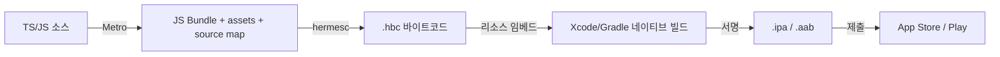

# 릴리즈 파이프라인

> release 빌드 버튼을 누르는 순간 JS가 어떻게 바이너리 안으로 들어가는지 — 그리고 그 뒤는 전부 아는 이야기(서명·제출)라는 것.

## iOS/AOS 대응 개념

| RN 단계 | iOS | Android |
|---|---|---|
| [[Metro]] 번들링 | 대응물 없음 (RN 고유의 추가 단계) | 대응물 없음 |
| [[Hermes]] 바이트코드 컴파일 | Swift → 기계어 컴파일과 발상이 같음 | R8/D8 → dex 컴파일과 발상이 같음 |
| 번들을 리소스로 임베드 | 앱 번들에 리소스 복사 | assets/에 리소스 패키징 |
| 서명 | 코드사이닝 + 프로비저닝 (그대로) | keystore 서명 (그대로) |
| 제출 | App Store Connect / TestFlight (그대로) | Play Console (그대로) |

**RN이 추가하는 것은 앞의 두 단계뿐이다.** 서명부터 스토어 심사까지는 기존 네이티브 릴리즈 지식이 100% 그대로 적용된다.

## 핵심 내용

### release 빌드에서 벌어지는 일 — 순서대로



1. **[[Metro]]가 [[Bundle]]을 생성한다.** 엔트리 파일(`index.ts`)부터 import 그래프를 따라가며 전체 JS를 하나의 번들로 묶는다. 이 과정에서 TS/JSX 변환(Babel), minify, 이미지 등 정적 에셋 수집, 그리고 **source map** 생성(릴리즈 후 에러 스택 심볼화의 재료 — dSYM에 해당)이 일어난다. dev 빌드에서는 Metro가 서버로 떠서 번들을 실시간 제공하지만, release 빌드에서는 이 결과물이 파일로 고정된다.
2. **[[Hermes]] 컴파일러(hermesc)가 JS 번들을 바이트코드(.hbc)로 AOT 컴파일한다.** 런타임 파싱 비용이 사라지고 시작 시간이 개선된다. 네이티브 개발자 감각으로는 "소스 배포 → 컴파일된 산출물 배포"로 바뀌는 지점.
3. **바이트코드가 앱 바이너리에 리소스로 임베드된다.** iOS는 `main.jsbundle`, Android는 `assets/index.android.bundle`이라는 이름으로 들어간다(내용은 .hbc). 이 두 단계는 Xcode Build Phase / Gradle task로 네이티브 빌드에 통합되어 있어서, `xcodebuild`·`gradlew`를 돌리면 자동 수행된다.
4. **서명 → 제출.** 여기서부터는 아는 것 그대로: 프로비저닝 프로파일, keystore, TestFlight, 단계적 출시, 심사.

즉 RN 릴리즈의 멘탈 모델: **"네이티브 앱 빌드인데, 빌드 초입에 JS 컴파일 단계가 하나 끼어 있다."**

### EAS Build/Submit vs 로컬 빌드/fastlane

| | [[EAS]] Build + Submit | 로컬 빌드 / fastlane |
|---|---|---|
| 빌드 위치 | Expo 클라우드 (macOS/Linux 워커) | 내 머신 / 자체 CI의 macOS 러너 |
| 서명 크리덴셜 | EAS가 생성·보관·갱신 대행 (선택) | 직접 관리 (match 등 — 기존 방식) |
| 설정 | `eas.json` 프로파일 | Fastfile + Xcode/Gradle 설정 |
| 제출 | `eas submit` 한 줄 | `deliver` / `supply` |
| 어울리는 팀 | 소규모~중간, 네이티브 빌드 인프라 없는 팀 | 기존 fastlane 자산이 있는 네이티브 팀, 브라운필드 |

- 두 방식은 배타적이지 않다. `npx expo prebuild`로 네이티브 프로젝트를 생성하면 그 뒤는 순수 Xcode/Gradle 프로젝트이므로 기존 fastlane 파이프라인에 그대로 태울 수 있다. EAS 없이 RN을 하는 것도 완전히 가능하다.
- EAS의 실질 가치: macOS 빌드 머신 유지보수와 인증서 관리를 아웃소싱하는 것 + JS-only 변경 감지(fingerprint)나 [[OTA Update]]와의 통합. 네이티브에서 인증서/프로파일 지옥을 겪어봤다면 무엇을 대행해 주는지 바로 감이 온다.
- 비용/큐 대기가 문제면 `eas build --local`로 같은 파이프라인을 자기 머신에서 돌릴 수도 있다.

### 버전 3축 — 앱 버전 vs JS 번들 vs runtime version

네이티브에서는 버전이 한 축(marketing version + build number)이지만, RN + OTA 체제에서는 세 축이 된다:

| 축 | 무엇 | 네이티브 대응 |
|---|---|---|
| **앱 버전** | `version`(1.2.0) + build number. 스토어에 보이는 것 | CFBundleShortVersionString / versionName — 동일 |
| **JS 번들 버전** | 지금 실행 중인 JS가 어느 커밋/업데이트인지. OTA로 바이너리와 독립적으로 바뀜 | 대응물 없음 — 새 개념 |
| **runtime version** | "이 바이너리가 어떤 JS를 실행할 수 있는가"의 호환성 계약. 네이티브 모듈·설정이 바뀌면 올려야 함 | ABI 호환성 개념에 가까움 |

핵심 규칙: **[[OTA Update]]는 같은 runtime version을 가진 바이너리에게만 배달된다.** 네이티브 의존성을 추가하고 runtime version을 안 올리면, 구 바이너리가 신 JS를 받아 크래시한다. 반대로 올바르게 올리면 구 바이너리는 자동으로 대상에서 제외된다. Expo에서는 `runtimeVersion` 정책(`appVersion` 연동, `fingerprint` 등)으로 관리한다 — 정책 선택지는 공식 문서 확인.

운영 시 사고 실험으로 이해 확인: "스토어에는 1.2.0(runtime A)과 1.3.0(runtime B)이 공존한다. 지금 OTA를 내보내면 누가 받는가?" — 이 질문에 즉답할 수 있어야 OTA 운영 자격이 있다.

### 환경 분리 — dev / staging / prod

네이티브에서 build configuration + xcconfig / productFlavors로 하던 일이다. Expo에서는:

- **`eas.json` 빌드 프로파일**로 환경별 빌드 정의 (`development` / `preview` / `production`).
- **app config를 동적으로**: `app.config.ts`에서 환경 변수를 읽어 앱 이름, 번들 ID, 아이콘을 분기 → **같은 기기에 dev/staging/prod 앱 3개를 나란히 설치** 가능 (번들 ID가 다르므로). 네이티브에서 flavor별 applicationIdSuffix 주던 것과 동일한 발상.
- **환경 변수**: EAS의 environment variables 기능 또는 `.env` + `EXPO_PUBLIC_` 접두사(클라이언트 노출용 — 비밀값 금지, [[04-보안과-접근성]] 참고).
- OTA 채널도 환경별로 분리: production 채널 / preview 채널.

### 릴리즈 체크리스트 (요약)

1. 버전 3축 확인: 앱 버전 올림 / runtime version 변화 여부 판단 (네이티브 변경 있었나?)
2. `eas build --profile production` (또는 fastlane 파이프라인)
3. **release 빌드 실기기 스모크 테스트** — dev와 release는 다른 산출물이다
4. source map / dSYM / mapping 업로드 확인 (Sentry release 생성)
5. `eas submit` → TestFlight/내부 트랙 → 단계적 출시
6. 출시 후: 크래시 대시보드 모니터링, 필요 시 hotfix는 JS-only면 [[OTA Update]], 네이티브면 재제출

## 코드/설정 예시

환경 분기하는 동적 app config (Expo SDK 57):

```typescript
// app.config.ts
import { ExpoConfig } from 'expo/config';

const ENV = process.env.APP_ENV ?? 'development'; // eas.json에서 주입

const suffix = { development: '.dev', staging: '.staging', production: '' }[ENV];
const name = { development: 'MyApp (Dev)', staging: 'MyApp (Stg)', production: 'MyApp' }[ENV];

export default (): ExpoConfig => ({
  name: name!,
  slug: 'my-app',
  version: '1.2.0',
  ios: { bundleIdentifier: `com.myteam.myapp${suffix}` },
  android: { package: `com.myteam.myapp${suffix}` },
  runtimeVersion: { policy: 'fingerprint' },
  updates: { url: 'https://u.expo.dev/…' },
});
```

```json
// eas.json — 프로파일별로 환경 변수 주입
{
  "build": {
    "development": {
      "developmentClient": true,
      "distribution": "internal",
      "env": { "APP_ENV": "development" }
    },
    "staging": {
      "distribution": "internal",
      "channel": "staging",
      "env": { "APP_ENV": "staging" }
    },
    "production": {
      "autoIncrement": true,
      "channel": "production",
      "env": { "APP_ENV": "production" }
    }
  },
  "submit": { "production": {} }
}
```

빌드와 제출:

```bash
eas build --profile production --platform all
eas submit --platform ios --latest   # App Store Connect로
eas submit --platform android --latest
```

## 함정 (Pitfalls)

- **"dev에서 되는데 release에서 안 됨."** dev는 Metro 서버 + 디버그 JS, release는 임베드된 Hermes 바이트코드다. minify로 드러나는 코드 문제, dev 전용 코드 경로(`__DEV__`), 번들에 안 실린 에셋 등이 원인. **release 빌드를 심사 제출 전에 반드시 실기기로 돌려볼 것** — 네이티브의 "Debug/Release 차이" 감각 그대로.
- **source map을 버리는 파이프라인.** release에서 JS 스택은 minify + 바이트코드라 source map 없이는 해독 불가. 빌드 산출물로 보관하거나 Sentry에 업로드.
- **runtime version 관리 소홀.** 네이티브 변경 후 runtime version을 안 올리고 OTA 발행 → 구 바이너리 크래시. `fingerprint` 정책으로 자동화하는 것이 안전.
- **버전/빌드넘버 수동 관리.** 스토어가 "이미 사용된 build number" 로 거부하는 그 익숙한 실패 — `autoIncrement`나 CI에서 자동 관리.
- **환경 분리 없이 번들 ID 하나로 운영.** staging 테스트가 prod 데이터를 오염시키는 사고의 지름길. 번들 ID 분리는 초기에 해야 싸다.
- **EAS를 쓰면 서명을 몰라도 된다는 착각.** 대행일 뿐이다. 엔터프라이즈 배포, 인증서 만료, entitlement 문제가 생기면 결국 기존 서명 지식으로 내려가서 풀어야 한다.

## 관련 노트

[[Metro]] · [[Bundle]] · [[Hermes]] · [[EAS]] · [[OTA Update]] · [[Prebuild]] · [[02-버전-업그레이드-전략]] · [[03-디버깅과-프로파일링]] · [[02-복잡한-앱]]
