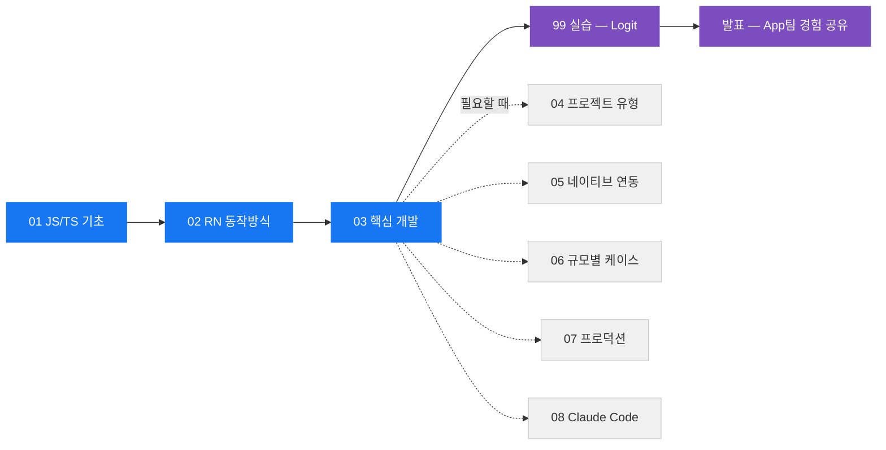

# RN Study — 네이티브 개발자를 위한 React Native 커리큘럼

> iOS/AOS 개발자 관점에서 React Native를 체계적으로 학습하기 위한 옵시디언 vault.
> 실습 코드베이스: 이 레포(Logit, Expo SDK 57). Expo 관련 내용은 반드시 https://docs.expo.dev/versions/v57.0.0/ 기준으로 확인.

🗺 **[[학습지도.canvas|학습지도 캔버스]]** — 전체 구조를 한 화면에서 보고 노트로 바로 진입.

## 학습 경로

> [!tip] 사용법 3줄
> - **01 → 02 → 03은 순서대로.** JS 멘탈모델 없이 RN을 만지면 계속 미끄러진다.
> - **04~08은 레퍼런스.** 필요할 때 찾아 읽는다. 전부 순서대로 읽으면 지친다.
> - 모르는 용어 → 아래 [[#00. 용어집 (40개)|용어집]]에서 찾고, 없으면 [템플릿](템플릿.md)으로 노트를 만든다.

> [!example] 산출물 바로가기
> - [[발표-App팀-RN-경험공유]] — greenfield(Logit) vs brownfield(Flitto) 실전 비교
> - [[99-실습-프로젝트/네이티브-개발자의-함정|네이티브 개발자의 함정]] — 학습하며 계속 추가하는 살아있는 노트
> - [[99-실습-프로젝트/README|실습 프로젝트 — Logit 기반]]

---

## 🚀 필수 트랙

### 01. JS/TS 기초 — 제일 먼저 막히는 곳

| # | 노트 | 답하는 질문 |
|---|---|---|
| 1 | [[01-JS-TS-기초/01-이벤트루프와-싱글스레드\|이벤트 루프와 싱글 스레드]] | 스레드 1개로 어떻게 비동기? 블로킹하면 무슨 일? |
| 2 | [[01-JS-TS-기초/02-Promise와-async-await\|Promise와 async/await]] | Swift async/await와 문법은 닮았는데 실행 모델은 왜 다른가 |
| 3 | [[01-JS-TS-기초/03-클로저와-스코프\|클로저와 스코프]] | Swift 클로저와의 차이, [[Stale Closure]]가 생기는 이유 |
| 4 | [[01-JS-TS-기초/04-모듈-시스템\|모듈 시스템]] | import/export와 [[Metro]]가 [[Bundle]]을 만드는 법 |
| 5 | [[01-JS-TS-기초/05-TypeScript-핵심\|TypeScript 핵심]] | 구조적 타이핑, "타입은 런타임에 없다"의 의미 |
| 6 | [[01-JS-TS-기초/06-패키지-매니저와-node_modules\|패키지 매니저와 node_modules]] | CocoaPods/SPM/Gradle 대응, npm install로 안 끝나는 패키지 |

### 02. RN 동작 방식 — 디바이스에서 앱이 뜨기까지

| # | 노트 | 답하는 질문 |
|---|---|---|
| 1 | [[02-RN-동작방식/01-앱-실행-시퀀스\|앱 실행 시퀀스]] | 아이콘 탭부터 첫 화면까지 전체 파이프라인 |
| 2 | [[02-RN-동작방식/02-스레드-모델\|스레드 모델]] | UI/JS/백그라운드 분업 — "JS 스레드를 막지 마라" |
| 3 | [[02-RN-동작방식/03-구아키텍처-Bridge\|구 아키텍처 — Bridge]] | JSON 비동기 큐 시절 (옛 블로그·라이브러리 해독용) |
| 4 | [[02-RN-동작방식/04-신아키텍처-JSI-Fabric-TurboModules\|신 아키텍처 — JSI·Fabric·Turbo Modules]] | [[New Architecture]] 4요소, 0.76부터 기본값 |
| 5 | [[02-RN-동작방식/05-Metro와-Hermes와-Yoga\|Metro·Hermes·Yoga]] | 빌드 시스템 / JS 엔진 / 레이아웃 엔진 3대 도구 |

### 03. 핵심 개발

| # | 노트 | 답하는 질문 |
|---|---|---|
| 1 | [[03-핵심-개발/01-컴포넌트와-JSX\|컴포넌트와 JSX]] | SwiftUI `View` / `@Composable` 자리에 있는 개념 |
| 2 | [[03-핵심-개발/02-상태와-렌더링\|상태와 렌더링]] | state가 바뀌면 **함수 전체 재실행** — 멘탈모델의 전부 |
| 3 | [[03-핵심-개발/03-스타일링과-Flexbox\|스타일링과 Flexbox]] | Auto Layout "제약 방정식" 사고 버리기 |
| 4 | [[03-핵심-개발/04-리스트-FlatList-FlashList\|리스트 — FlatList와 FlashList]] | 가상화 — RecyclerView "재활용"과 다른 점 |
| 5 | [[03-핵심-개발/05-내비게이션\|내비게이션]] | 내장이 없다 — [[React Navigation]] vs [[Expo Router]] |
| 6 | [[03-핵심-개발/06-상태관리\|상태 관리]] | 라이브러리보다 상태의 **종류**(로컬/전역/서버)가 먼저 |
| 7 | [[03-핵심-개발/07-애니메이션-Reanimated\|애니메이션 — Reanimated]] | 애니메이션을 UI 스레드로 옮겨([[Worklet]]) 60fps |
| 8 | [[03-핵심-개발/08-제스처\|제스처]] | RNGH — 제스처 인식을 네이티브에 맡기기 |
| 9 | [[03-핵심-개발/09-플랫폼-분기\|플랫폼 분기]] | `Platform` 런타임 분기 vs `.ios.tsx` 빌드 분기 |

---

## 📚 레퍼런스 — 필요할 때 펼쳐 읽기

> [!note]- 04. 프로젝트 유형 — Expo/Bare × 그린필드/브라운필드 (3)
>
> | # | 노트 | 답하는 질문 |
> |---|---|---|
> | 1 | [[04-프로젝트-유형/01-Expo-vs-Bare\|Expo vs Bare]] | `ios/`를 "소스"로 소유할 것인가 "생성물"로 취급할 것인가 |
> | 2 | [[04-프로젝트-유형/02-그린필드-vs-브라운필드\|그린필드 vs 브라운필드]] | 신규 앱 vs 기존 네이티브 앱에 RN 삽입 |
> | 3 | [[04-프로젝트-유형/03-의사결정-매트릭스\|의사결정 매트릭스]] | 4분면 중 어디에 설 것인가 — 결론 요약 |

> [!note]- 05. 네이티브 연동 — 네이티브 개발자의 무기 (4)
>
> | # | 노트 | 답하는 질문 |
> |---|---|---|
> | 1 | [[05-네이티브-연동/01-Turbo-Native-Module-작성\|Turbo Native Module 작성]] | TS 스펙 → [[Codegen]] → Swift/Kotlin 구현 정공법 |
> | 2 | [[05-네이티브-연동/02-Fabric-Native-Component\|Fabric Native Component]] | 커스텀 네이티브 뷰를 JSX 트리 안에서 쓰기 |
> | 3 | [[05-네이티브-연동/03-Expo-Modules-API\|Expo Modules API]] | Swift/Kotlin DSL로 같은 일을 더 편하게 |
> | 4 | [[05-네이티브-연동/04-Autolinking과-라이브러리-평가\|Autolinking과 라이브러리 평가]] | npm 패키지의 네이티브 코드가 빌드에 편입되는 원리 |

> [!note]- 06. 규모별 케이스 (3)
>
> | # | 노트 | 답하는 질문 |
> |---|---|---|
> | 1 | [[06-규모별-케이스/01-간단한-앱\|간단한 앱]] | 1인 빠른 출시 — 커뮤니티 기본값 그대로 따르기 |
> | 2 | [[06-규모별-케이스/02-복잡한-앱\|복잡한 앱]] | 화면 수십 개·실트래픽에서 성능·안정성·운영 |
> | 3 | [[06-규모별-케이스/03-팀-협업\|팀 협업]] | "서로 다르게 짜지 못하게" 기계로 강제하기 |

> [!note]- 07. 프로덕션 (4)
>
> | # | 노트 | 답하는 질문 |
> |---|---|---|
> | 1 | [[07-프로덕션/01-릴리즈-파이프라인\|릴리즈 파이프라인]] | JS가 바이너리 안으로 들어가는 순간 — 뒤는 아는 이야기 |
> | 2 | [[07-프로덕션/02-버전-업그레이드-전략\|버전 업그레이드 전략]] | RN 최대 고통 포인트 — Expo SDK 단위 + [[CNG]]가 답인 이유 |
> | 3 | [[07-프로덕션/03-디버깅과-프로파일링\|디버깅과 프로파일링]] | "어느 층의 문제인가"부터 판정하기 |
> | 4 | [[07-프로덕션/04-보안과-접근성\|보안과 접근성]] | 네이티브 지식이 거의 1:1로 이전되는 영역 |

> [!note]- 08. Claude Code 활용 (1)
>
> | # | 노트 | 답하는 질문 |
> |---|---|---|
> | 1 | [[08-Claude-Code-활용/01-Claude-Code-RN-워크플로\|Claude Code RN 워크플로]] | RN 학습·개발에 Claude Code를 어떻게 쓰나 |

---

## 00. 용어집 (40개)

용어 1개 = 노트 1개. 본문에서 `[[용어]]`로 링크. 없으면 [템플릿](템플릿.md)으로 생성.

> [!abstract]- 엔진/아키텍처 (10)
> [[Hermes]] · [[JSI]] · [[Bridge]] · [[Bridgeless]] · [[Fabric]] · [[Turbo Module]] · [[Codegen]] · [[Shadow Tree]] · [[Yoga]] · [[New Architecture]]

> [!abstract]- 빌드/도구 (11)
> [[Metro]] · [[Bundle]] · [[Fast Refresh]] · [[Autolinking]] · [[Prebuild]] · [[CNG]] · [[Config Plugin]] · [[Dev Client]] · [[Expo Go]] · [[EAS]] · [[OTA Update]]

> [!abstract]- React (8)
> [[JSX]] · [[Hook]] · [[Props]] · [[State]] · [[Re-render]] · [[Reconciliation]] · [[Stale Closure]] · [[Memoization]]

> [!abstract]- 생태계 (11)
> [[Expo Router]] · [[React Navigation]] · [[Reanimated]] · [[Worklet]] · [[FlatList]] · [[Expo Modules API]] · [[Monorepo]] · [[Managed Workflow]] · [[Bare Workflow]] · [[Greenfield]] · [[Brownfield]]

---

> [!warning]- 검증 원칙
> - 이 vault의 내용은 **RN 0.76+ (New Architecture 기본) / Expo SDK 57** 기준.
> - 버전에 민감한 내용(설정 파일, CLI 명령, API)은 노트에 기준 버전을 명시한다.
> - 확실하지 않은 내용은 적지 않는다. "버전에 따라 다름 — 공식 문서 확인"으로 남긴다.
> - 참고 원천: reactnative.dev 공식 문서, docs.expo.dev (버전 고정 URL), 각 라이브러리 공식 문서.
